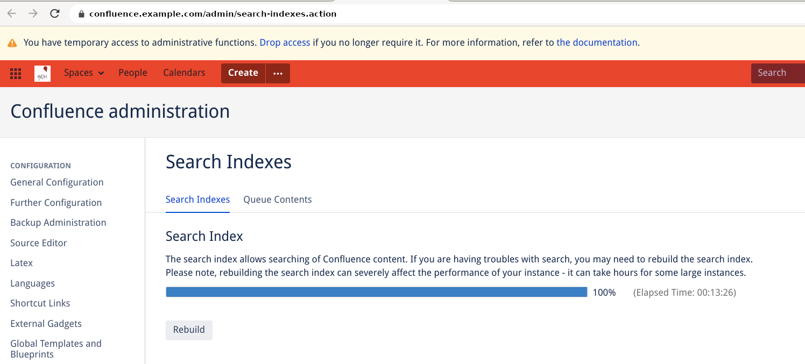
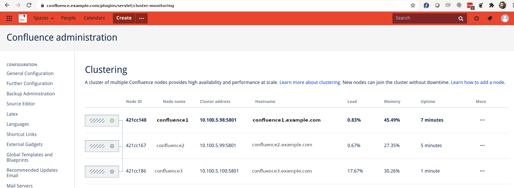

# Confluence upgrade from 6.4.0 (standalone) to 7.4.3 LTS (data-center)

I chose to write this guide because I needed a concise step-by-step "how-to" to upgrade a confluence (standalone) instance to data-center for a client. I thought that there should be a complete guide which not only benefits me, but also benefits my colleagues, and of-course other people in the world. 

While working on this project, I noticed that Atlassian's official documentation lacks information about various important tasks, which are critical. For example, Atlassian does not talk about the configuration of the PostgreSQL database server, or the NFS share, or synchronization of time across entire infrastructure. I consider these important to be mentioned in any such guide. A lot of deployments are VM based, and the choice of Virtualization technology, it's overhead, and the configuration of the Virtualization host is also something to be kept under consideration. Encryption-at-rest, i.e. disk encryption is also a factor in performance, as it slows down I/O operations. The network firewalls, antivirus, and other security measures also play their role in performance. In short, many aspects around OS, Network and Security, must be considered, evaluated and configured properly before expecting performance from any of your service, whether it is Atlassian product or not.

**This guide talks about Confluence, but the general principles apply to Jira as well.**


## So, what is the task at hand?

In this guide, I will migrate, upgrade, and convert a Confluence standalone instance running on a single VM to datacenter mode running on three nodes/VMs. The database service will be moved to a separate standalone server.

The general straight-forward approach will be:
* Install a fresh instance on Confluence on a new VM - as standalone
* Migrate the old data (DB + attachments) to the new DB server and the new Confluence server respectively
* Upgrade Confluence 6.4.0 (standalone) to Confluence 7.4.3 (standalone)
* Convert Confluence 7.4.3 standalone version to Confluence 7.4.3 datacenter version by applying the **datacenter license**.

However, sometimes, the client may have a expired - or soon-to-expire - Confluence (standalone) license, and they may want to not renew it; and may want to upgrade/convert to data-center instead, while upgrading the version of Confluence along the way. This is very much understandable, and is do-able. In this case the approach will be:

* Install a fresh instance on Confluence on a new VM - as standalone
* Migrate the old data (DB + attachments) to the new DB server and the new Confluence server respectively
* Convert Confluence 6.4.0 standalone to Confluence 6.4.0 datacenter by applying the **datacenter license**.
* Upgrade Confluence 6.4.0 (datacenter) to Confluence 7.4.3 (datacenter)

In fact, this is the scenario covered in this guide.

## The infrastructure:
All VMs in this setup run Linux OS. 

### Existing / old setup:
* 1 x VM running Confluence, Jira and PostgreSQL database. (`old-confluence.example.com`)

### New setup (Test & Production):
* 1 x VM for PostgreSQL database (`db.example.com`)
* 3 x VMs for Confluence (`confluence1.example.com`,`confluence2.example.com`,`confluence3.example.com` )
* 1 x NFS share served from a separate/dedicated NFS server (`nfs.example.com`)


# The flight plan:
It is expected that you test the complete plan on some test infrastructure. When successful, **only then** perform the production migration.

## Pre-flight checks/preparation:
* In case your Confluence instance looks up user information from a Jira server (Crowd), then make sure that the new Confluence (test and production) servers' IP addresses are added to the "Jira User Server" on production Jira instance. `Jira -> Settings -> User management -> Jira user server`
* In case your Confluence instance looks up user information from a LDAP/AD server, then make sure that the new Confluence (test and production) servers' IP addresses are allowed to access the LDAP/AD.
* Have a SSL reverse-proxy/load-balancer ready with session affinity and WebSockets support. This will be configured later to point to your new Confluence (test or production) setup.
* Verify sudo/root access on related infrastructure.
* Update OS on all servers
* Preferably disable local/host firewall on any of the servers; or, open necessary ports on host firewalls. 
* Preferably disable SELinux / AppArmor; or, set the right security context for the directories where the Confluence process will read and write files. Remember, SELinux requires a filesystem that supports "security labels", and thus cannot provide access control for files mounted via NFS.
* Since this is a "cluster", **NTP/Chrony** needs to be installed and it's service running - on all servers.
* System timezone should be correctly configured - on all servers.
* Install `fontconfig` and related OS packages - on all confluence servers. This will save you from some pain later.
* Create `confluence` user and `confluence` group - on all confluence servers - **with same UID and GID**.
* Synchronize necessary SSH keys to the DB and Confluence servers
* Improve NFS server (and client) performance
* Mount NFS share on all confluence servers on `/confluence`, with correct ownership and permissions
* **rsync** attachments from old server to `/confluence/shared-home/attachments` *before the actual migration*. This will save time later. Later, we will do the rsync again, which will copy the final changes (deltas) to the NFS mount-point.
* Install Postgres 9.6 on the new DB server
* Optimize Postgres memory parameters so it uses RAM optimally
* Configure memory (java heap) correctly on all confluence servers


## In-flight steps:
* Stop Confluence service on the production server, so the Confluence service does not change any data in the database, nor it changes any data files in its data directory.
* Configure the SSL load-balancer with session affinity and WebSockets support in front of the cluster, and make sure that the correct URL (depending on test or production migration) now points to the three new confluence nodes. Yes. This would need to be done right after we stop confluence service on the old server. The new setup would need to be accessed by the correct URL, so it can be configured correctly.
* Dump "confluence" database from existing db server.
* Create confluence database on new DB server, with correct encoding and correct collation
* Restore confluence database dump on the new DB server.
* Install confluence `6.4.0` on confluence node-1 only
* Copy Confluence related data files from old server to new server, adjust configuration files, and start Confluence
* Perform basic checks
* Convert the confluence node-1 to data-center mode by applying "data-center license".
* Adjust files and re-locate directories related to share-home and attachments
* Upgrade version of Confluence on data-center node 1 from `6.4.0` to `7.4.3 LTS` 
* Perform basic checks (including Cluster checks)

## Post-touchdown checks:
* Update / fix plugins
* Add more nodes - one at a time
* Perform cluster related checks
* If everything works as expected, completely disable Confluence service on the old Confluence server.
* Done.

------

# Actual steps:

## Infrastructure setup:

### Update OS on all servers:
Execute the following on **all servers** - as user `root`:

**Red Hat and derivatives:**
```
yum -y update  && reboot
```

**Debian and derivatives:**
```
apt-get -y update && apt-get -y upgrade && apt-get -y autoremove && reboot
```

**Note:** It is important to reboot all servers after `update`/`upgrade` process, as this operation may install a newer kernel.

### Setup Chrony/NTP:

Chrony is the newer version of NTP. If you don't have chrony on your OS, just install ntp. Execute the following on **all servers**, as user `root`:


**Red Hat and derivatives:**
```
yum -y install chrony

systemctl enable chronyd

systemctl start chronyd
```

**Debian and derivatives:**
```
apt-get -y install ntp 

systemctl enable ntp

systemctl start ntp
```

### Set correct timezone on all servers:
Make sure that `ls -l /etc/localtime` command reports correct timezone for **all of your servers**. 

```
[root@db ~]# ls -l /etc/localtime 
lrwxrwxrwx 1 root root 37 Aug  6 12:38 /etc/localtime -> /usr/share/zoneinfo/Europe/Oslo
```

If incorrect, then set it to correct timezone as follows - **on all servers**:
```
ln -s -f  /usr/share/zoneinfo/Europe/Oslo  /etc/localtime
```


### Install fontconfig on all confluence servers:
If `fontconfig` is absent from the OS, you will get an error message from Confluence:

> **"The Fonts health check has failed in your system."**

**Reason:** `AdoptOpenJDK` does not include a font configuration package, which Confluence relies on. 

**Solution:** Install fontconfig (or an equivalent) on **all Confluence servers** before installing Confluence. 


**Red Hat and derivatives:**
```
yum -y install fontconfig dejavu-fonts-common
```

**Debian and derivatives:**
```
apt-get -y install fontconfig fonts-dejavu-core 
```


### Create Confluence user and group on all Confluence servers:

Since Confluence will run as a *service*, it is best to create a dedicated group `confluence` and a dedicated user `confluence` on all the new confluence servers. This being a *service*, it should be assigned a fixed `uid` and fixed `gid`, below 1000, so there is no chance of this being changed by introduction/creation of any other user on these servers. I suggest that you create group `confluence` with gid `900`, and user `confluence` with uid `900`; and make this user a member of this group only. There is **no need** to make it a member of sudo/wheel/admin, etc.

Execute the following on **all (new) Confluence** servers:

```
groupadd --gid 900 confluence
useradd -m --uid 900 --gid 900 confluence
```

Also create `.ssh` directory under the user's home directory:
```
mkdir /home/confluence/.ssh
chown confluence:confluence /home/confluence/.ssh
chmod 0700 /home/confluence/.ssh
```

### Setup key-based SSH login on all servers:
 
We want to be sure that we can export and import DB dump, and copy Confluence files from old server to new one. So, this step will ensure that we will be able to:

* copy the confluence database backup/dump from old-confluence server to the new db server
* copy the data files (and attachments) of confluence from old-confluence server to new Confluence node-1
* copy data files from confluence node-1 to the other two confluence nodes - when the time comes 

**Note:** I am aware that this step can be done in several different ways depending on your setup, and the choice of various users you want to use on various machines for SSH. There is no **one way** of doing it. It is just that I chose to do it they way explained in this document. Feel free to use a different method if you want to.


Copy the public part of ssh key of user `root` from old-confluence server to the `/home/confluence/.ssh/authorized_keys` of user `confluence` on the new **Confluence node-1 only**.


Copy the contents of this file from old-confluence server:
```
[root@old-confluence ~]# cat .ssh/ida_rsa.pub 
```

to, `/home/confluence/.ssh/authorized_keys` on new confluence server.

```
vi /home/confluence/.ssh/authorized_keys 
```

Fix ownership and permissions of the authorized_keys file on confluence node-1:

```
chown confluence:confluence /home/confluence/.ssh -R
chmod 700 /home/confluence/.ssh
chmod go-w /home/confluence/.ssh/authorized_keys 
```


Next, generate the SSH key-pair for user `root` on new Confluence node-1, 

```
ssh-keygen -t rsa
```

, and then copy the resulting public key to `/home/confluence/.ssh/authorized_keys` of user `confluence` on the other two Confluence nodes. In this way confluence node-1 will act as the source of all file operations for the other two nodes. Only confluence node-1 needs to access the other two confluence nodes. 

In this way, user `root` from the old-confluence server will be able to log on to the new Confluence node-1 as user `confluence`.


Next, generate the SSH key-pair for user `root` on the new db server. This will also create the `.ssh` directory inside `/root/`. Execute the following on the new db server.

```
ssh-keygen -t rsa
```


Now, copy the public part of ssh key of user `root` from old-confluence server to the `/root/.ssh/authorized_keys` of user `root` on the **new db server**.


Copy the contents of this file from old-confluence server:
```
[root@old-confluence ~]# cat .ssh/ida_rsa.pub 
```

to, `/root/.ssh/authorized_keys` of user `root` on new db server.

```
vi /root/.ssh/authorized_keys 
```

Fix permissions of this file:
```
chmod go-w /root/.ssh/authorized_keys
```

In this way, user `root` from the old-confluence server will be able to log on to the new db server as user `root`.


## Mount the NFS share on all Confluence nodes:

Make sure to mount the correct NFS export from the correct NFS server. Execute the following commands on **all confluence nodes**.

```
vi /etc/fstab
. . . 
nfs.example.com:/confluence   /confluence   nfs rw,hard,intr,rsize=1048576,wsize=1048576,tcp,noatime,vers=3 0 0
```

```
mount -a
```


Verify that it is mounted correctly on all Confluence nodes:

```
[root@confluence1 ~]# mount -a


[root@confluence1 ~]# df -hT
Filesystem                                     Type      Size  Used Avail Use% Mounted on
udev                                           devtmpfs  3.9G     0  3.9G   0% /dev
tmpfs                                          tmpfs     798M  804K  797M   1% /run
/dev/mapper/confluence-1--vg-root              ext4       58G   20G   36G  36% /
tmpfs                                          tmpfs     3.9G     0  3.9G   0% /dev/shm
tmpfs                                          tmpfs     5.0M     0  5.0M   0% /run/lock
tmpfs                                          tmpfs     3.9G     0  3.9G   0% /sys/fs/cgroup
nfs.example.com:/confluence                    nfs       294G  160G  135G  55% /confluence
tmpfs                                          tmpfs     798M     0  798M   0% /run/user/1003
[root@confluence1 ~]#
```


## Improve NFS performance:

Right now, the NFS mount has the following options:

```
[root@confluence1 ~]# df -hT
Filesystem                                     Type      Size  Used Avail Use% Mounted on
udev                                           devtmpfs  3.9G     0  3.9G   0% /dev
tmpfs                                          tmpfs     798M  836K  797M   1% /run
/dev/mapper/confluence-1--vg-root              ext4       58G   20G   36G  36% /
tmpfs                                          tmpfs     3.9G     0  3.9G   0% /dev/shm
tmpfs                                          tmpfs     5.0M     0  5.0M   0% /run/lock
tmpfs                                          tmpfs     3.9G     0  3.9G   0% /sys/fs/cgroup
nfs.example.com:/confluence                    nfs       294G  188G  107G  64% /confluence
tmpfs                                          tmpfs     798M     0  798M   0% /run/user/1000
tmpfs                                          tmpfs     798M     0  798M   0% /run/user/1003
[root@confluence1 ~]# 


[root@confluence1 ~]# mount
. . . 

nfs.example.com:/confluence on /confluence type nfs (rw,noatime,vers=3,rsize=32768,wsize=32768,namlen=255,hard,proto=tcp,timeo=600,retrans=2,sec=sys,mountaddr=10.100.2.219,mountvers=3,mountport=635,mountproto=tcp,local_lock=none,addr=10.100.2.219)

```

**Question:** As you can see, we are using NFS v3, and the `rsize` and `wsize` are just `32k`, whereas we set the values of these buffers to 1MB (`1048576`), so why is it so? 

**Explanation:** The first thing to note is that 1MB is the maximum allowed size for `rsize` and `wsize` buffers, and these values can only be set on the client side while mounting the NFS share. As soon as the mount request reaches the NFS server, the client and server negotiate the maximum possible size for these buffers. So, the times when the network, and various OS settings are configured correctly, both client and server agree on using the requested value. However, if the settings are not optimal, or if the network is not configured correctly, or if there are other hurdles present between the NFS server and the client, such as host/network (deep) packet inspection firewall(s), or antivirus, etc, then the negotiated size for these buffers will be lower than what was requested by the client. This is the reason you see 32k (`32768`) as the value for `rsize` and `wsize` buffers, despite the fact that we (the client) requested 1MB.  

In this setup we have to live with 32k as the values for `rsize` and `wsize`.


### Verify / test:
Now, we try to get an idea of the speed of this NFS link. i.e. how fast can we write a 1GB file from client to the NFS server.

Write a 1 GB file to NFS, block-size 32k:
```
[root@confluence1 ~]# time dd if=/dev/zero of=/confluence/testfile.tmp bs=32k count=31250
31250+0 records in
31250+0 records out
1024000000 bytes (1.0 GB, 977 MiB) copied, 1.63241 s, 627 MB/s

real	0m1.646s
user	0m0.016s
sys	0m0.599s
[root@confluence1 ~]# 
```

Remember, the servers are connected over a 10 Gigabit/s (or, 1.25 Gigabyte/s) (or, 1250 Megabyte/s) network . What we got is 627 MB/s , which is almost half of the ideal. This shows there is a lot of room for improvement. Though this *"improvement"* varies from case to case, situation to situation, setup to setup, and there are lot of variables to consider. (disk speed on NFS server, NFS server version, NFS server OS and it's various TCP settings, NFS server's network connection, any security aspects, client's network connection, OS settings, client NFS mount options, *and* **VM overhead**, etc, etc. There is no one-size-fits-all solution to improve network performance. Sometimes some aspects of the setup may be beyond your jurisdiction/control, such as NFS server being a centrally managed storage appliance - NetApp, etc.   

### Get an idea of network throughput using iperf - optional step:

You can use iperf (iperf3) on NFS server and on the NFS client to check the maximum data transfer rate between them. Note, this is purely network test, and does not read/write any files on the disks. So this can not be used to benchmark NFS performance.

Install and run iperf3 on the NFS server:
```
iperf3 -s
```

On the client, run iperf3 to connect to iperf3 running on the NFS server. The command below will try to use maximum block size to write to target. 
```
iperf3 -c nfs.example.com
```

Make a note of the output of the above command. This will act as your base value. 

**iperf options:**
* -c : run  in  client mode, connecting to the specified server.
* -b : set target bitrate to n bits/sec (default 1 Mbit/sec for UDP, unlimited for TCP/SCTP).
* -u : use UDP instead of TCP
* -w : window size / socket buffer size (this gets sent to the server and used on that side too)


#### Sample `iperf` output from two physical computers connected to 1Gbps switch:

```
[root@pserver5 ~]# iperf3 -s 
-----------------------------------------------------------
Server listening on 5201
```

```
[root@client-pc ~]# iperf3 -c 192.168.0.10
Connecting to host 192.168.0.10, port 5201
[  5] local 192.168.0.62 port 54202 connected to 192.168.0.10 port 5201
[ ID] Interval           Transfer     Bitrate         Retr  Cwnd
[  5]   0.00-1.00   sec   112 MBytes   943 Mbits/sec    0    329 KBytes       
[  5]   1.00-2.00   sec   111 MBytes   934 Mbits/sec    0    376 KBytes       
[  5]   2.00-3.00   sec   112 MBytes   938 Mbits/sec    0    376 KBytes       
[  5]   3.00-4.00   sec   111 MBytes   930 Mbits/sec    0    376 KBytes       
[  5]   4.00-5.00   sec   111 MBytes   931 Mbits/sec    0    395 KBytes       
[  5]   5.00-6.00   sec   112 MBytes   936 Mbits/sec    0    416 KBytes       
[  5]   6.00-7.00   sec   111 MBytes   934 Mbits/sec    0    416 KBytes       
[  5]   7.00-8.00   sec   111 MBytes   934 Mbits/sec    0    416 KBytes       
[  5]   8.00-9.00   sec   111 MBytes   934 Mbits/sec    0    416 KBytes       
[  5]   9.00-10.00  sec   111 MBytes   927 Mbits/sec    0    416 KBytes       
- - - - - - - - - - - - - - - - - - - - - - - - -
[ ID] Interval           Transfer     Bitrate         Retr
[  5]   0.00-10.00  sec  1.09 GBytes   934 Mbits/sec    0             sender
[  5]   0.00-10.00  sec  1.09 GBytes   933 Mbits/sec                  receiver

iperf Done.
[root@client-pc ~]#
```

### Other non-obvious players affecting performance:
* Configuration and quality of the networking equipment
* Network hops between servers
* Routers/firewalls between different network segments
* Host firewall rules on individual servers
* SELinux /App Armour
* AntiVirus 
* Encryption at rest (disk encryption)
* Encryption in transit (SCP, rsync over SSH, SFTP)
* Virtualization overhead


## Tune network related settings on OS - on all new servers - optional (Advanced topic):

TCP tuning may not result in huge performance gain. However, when you have configured the rest of infrastructure correctly, and have will (and patience) to turn more knobs to squeeze maximum juice out of the network stack, then this might be of interest to you. Intimate knowledge of Linux OS is required, and if set incorrectly, it can actually result in degraded performance. Tread carefully.

The default TCP network queue sizes are set to very small by default (~ 200KB). They can be increased, on NFS servers and NFS clients:

```
[root@confluence1 ~]# cat /proc/sys/net/core/rmem_default
212992

[root@confluence1 ~]# cat /proc/sys/net/core/wmem_default 
212992

[root@confluence1 ~]# cat /proc/sys/net/core/rmem_max
212992

[root@confluence1 ~]# cat /proc/sys/net/core/wmem_max
212992

[root@confluence1 ~]# 
```

or

```
[root@confluence1 ~]#  sysctl -a | egrep '\..mem_'

net.core.rmem_default = 524288
net.core.rmem_max = 524288
net.core.wmem_default = 524288
net.core.wmem_max = 524288
```

Depending on the network speed of your network interface cards, and of-course the network they are connected to, the buffers can be adjusted to higher values.

* The "default" can be set between 256KB (`262144`) and 1MB (`1048576`)
* For 1GE (1 Gigabit Ethernet), the "max" buffers can be set to 16MB (`16777216`).
* For 10GE (10 Gigabit Ethernet), the "max" buffers can be set to 32MB (`33554432`) or even 54MB.


Increase the buffers to on all new nodes:

```
echo 'net.core.rmem_default = 524288' >> /etc/sysctl.conf
echo 'net.core.wmem_default = 524288' >> /etc/sysctl.conf
echo 'net.core.rmem_max = 33554432' >> /etc/sysctl.conf
echo 'net.core.wmem_max = 33554432' >> /etc/sysctl.conf
```

TCP auto-tuning needs appropriate buffer limits for min, default, and max number of bytes to use. Use 4KB for min, 512KB for default and 32MB for max: 
```
echo "net.ipv4.tcp_rmem = 4096 524288 33554432"  >> /etc/sysctl.conf
echo "net.ipv4.tcp_wmem = 4096 524288 33554432"  >> /etc/sysctl.conf
```

Set the following to the default value of `1`:

```
echo "net.ipv4.tcp_window_scaling = 1"     >> /etc/sysctl.conf
echo "sysctl net.ipv4.tcp_timestamps = 1"  >> /etc/sysctl.conf
echo "sysctl net.ipv4.tcp_sack = 1"        >> /etc/sysctl.conf
```


 
References:
* [https://community.pivotal.io/s/article/how-to-increase-the-socket-buffer-size-limit-at-the-os-level?language=en_US](https://community.pivotal.io/s/article/how-to-increase-the-socket-buffer-size-limit-at-the-os-level?language=en_US)
* [https://wwwx.cs.unc.edu/~sparkst/howto/network_tuning.php](https://wwwx.cs.unc.edu/~sparkst/howto/network_tuning.php)
* [http://www-didc.lbl.gov/TCP-tuning/](http://www-didc.lbl.gov/TCP-tuning/)
* [http://www.linux-admins.net/2010/09/linux-tcp-tuning.html](http://www.linux-admins.net/2010/09/linux-tcp-tuning.html)

------------

## Check network performance again after TCP tuning:

### iperf:
At this point, you should run the network benchmarks again, and see if you get any improvement. If not, then perhaps that is the max you can extract out of it.

Run iperf3 on the NFS server:
```
iperf3 -s
```

On the client, run iperf3 to connect to iperf3 running on the NFS server. The command below will try to use maximum block size to write to target. 
```
iperf3 -c nfs.example.com
```

### File creation over NFS:

The NFS mount is mounted with the following options:
```
[root@client-pc ~]# mount
. . . 
192.168.0.10:/opt/nfs on /mnt/nfs type nfs (rw,noatime,vers=3,rsize=1048576,wsize=1048576,namlen=255,hard,proto=tcp,timeo=600,retrans=2,sec=sys,mountaddr=192.168.0.10,mountvers=3,mountport=20048,mountproto=tcp,local_lock=none,addr=192.168.0.10)
```

Below is output of a dd command used to write a 1GB file using NFS, over a 1Gbit network switch in my home. Both client and servers are physical hosts.

```
[root@client-pc ~]# time dd  if=/dev/zero of=/mnt/nfs/nfs-1G.tmp bs=1M count=1024
1024+0 records in
1024+0 records out
1073741824 bytes (1.1 GB, 1.0 GiB) copied, 9.83763 s, 109 MB/s

real	0m10.185s
user	0m0.003s
sys	0m0.689s
[root@client-pc ~]# 
```


We know that `1Gbps/8` is `125MBps`. Above, I got the throughput of `109 MBps`. If we do the math, `109 Mbps / 125 Mbps * 100` gives us `87.2`, which is 87.2% efficiency - not bad!. 

Just so you know, the network switch used in this example is a cheap off-the-shelf switch preventing me from achieving higher performance. So, quality of the network equipment matters too.


------------ 

## Increase various OS/kernel limits on all servers:

Adjust the following on **all servers**:

* Kernel: nofiles (set it to 16k (soft) and 32k(hard) )
* Kernel: vm.overcommit_memory (set it to 2)
* Kernel: vm.swappiness (Set it to 0 or 1)


### nofiles:

Add the following two lines to `/etc/security/limits.conf` to increase number of open files to 16k (soft limit) and 32k (hard limit). (Default is 1K) . Execute the following as `root`.
```
echo '*       soft    nofile  16384' >> /etc/security/limits.conf
echo '*       hard    nofile  32768' >> /etc/security/limits.conf
```

The max possible value for `nofiles` is 64K (`65536`). Adjust to higher values if required.

### vm.overcommit_memory:

In Linux 2.4 and later, **the default virtual memory behavior is not optimal for PostgreSQL**. Because of the way that the kernel implements memory overcommit, the kernel might terminate the PostgreSQL postmaster (the master server process) if the memory demands of either PostgreSQL or another process cause the system to run out of virtual memory.

On Linux 2.6 and later, it is possible to modify the kernel's behavior so that it will not "overcommit" memory. Although this setting will not prevent the OOM killer from being invoked altogether, it will lower the chances significantly and will therefore lead to more robust system behavior. This is done by selecting strict overcommit mode via `sysctl`, or placing an equivalent entry in `/etc/sysctl.conf`  - as `root`:

```
sysctl -w vm.overcommit_memory=2
```

```
echo 'vm.overcommit_memory=2' >>  /etc/sysctl.conf 
```

### vm.swappiness:

`vm.swappiness` is another kernel parameter that can affect the performance of the database. This parameter is used to control the swappiness (swapping pages to and from swap memory into RAM) behavior on a Linux system. The value ranges from 0 to 100 (in percentage). It controls how much memory will be swapped or paged out. Zero means disable swap and 100 means aggressive/too-much swapping.

The default value for this kernel parameter on a Linux system is 60. A higher value causes the MMU (memory management unit) to utilize more swap space than RAM, whereas a lower value preserves more data/code in memory. 

Ideally, in modern time, swap must be switched off completely - as plenty of RAM is assigned to servers / VMs. If a process dies because of lack of available RAM, then it is much better to tune/adjust/lower the memory parameters of that process instead of enabling swap. 

Disable swap by executing the following commands as root:

```
echo 'vm.swappiness=0' >>  /etc/sysctl.conf 

swapoff -a
```

However, if you really want to use swap, set `vm.swappiness` to lower values, such as `1`, to minimize swapping. 

```
echo 'vm.swappiness=1' >>  /etc/sysctl.conf 
```


Check your settings with:
* `sysctl -a`
* `ulimit -a`


------------

## Copy (rsync) attachments from old Confluence server to NFS share:

This is very interesting step. 

Remember, this entire exercise is to migrate/upgrade a single instance Confluence to Data-Center mode. Data-center mode requires that the attachments (and a directory named `shared-home`) be moved to shared storage - NFS in this case. Sure, but the first step of our migration process is to move the Confluence installation from old server (VM) to the new one. This means that the file and directory layout must remain same, and nothing should change it's location. 

We can hit two birds with one stone, by using a trick. We copy the attachments to the NFS share mounted on new Confluence node-1. Later, when we set up that new node as standalone Confluence node, we will simply make a symbolic link from where the attachments should be (Confluence home), to where the attachments really are  (on NFS storage). This saves us a lot of time in situations when attachments directory is large in size (100GB+) - which sometimes take a lot of time to move around. Also, it is not guaranteed that the new server would have enough disk space in it's `/var` location, where Atlassian sets up Confluence home. 

For this reason we will sync the attachments to NFS share. 

The other reason to do this step at this point in time is to save time. Assuming the attachments directory is large in size, it is wise to sync it before the actual migration. Later during the actual migration, we will do a second sync to copy only the files changed since last sync. This is very efficient. Remember, we are in the process of setting up other components of the system anyway, so this will work sort of in the background.

Below is the typical layout of a fresh Confluence installation.
```
[root@confluence1 ~]# tree -L 1 /var/atlassian/application-data/confluence/
/var/atlassian/application-data/confluence/
├── analytics-logs
├── attachments
├── backups
├── bundled-plugins
├── confluence.cfg.xml
├── imgEffects
├── index
├── journal
├── lock
├── logs
├── plugins-cache
├── plugins-osgi-cache
├── plugins-temp
├── shared-home
├── temp
├── viewfile
└── webresource-temp
```

Here is the NFS shared directory tree layout on the same server:

```
[root@confluence1 ~]# tree  /confluence/
/confluence/
└── shared-home
    └── attachments
```


The above NFS share directory layout was created using the following command on Confluence node-1 only. Go ahead and execute the following commands:

```
mkdir -p /confluence/shared-home/attachments
chown -R confluence:confluence /confluence 
```


Now we copy all the `attachments` from old server to the NFS share - using `rsync`. 

**Note:** rsync is the best option to copy entire directory structures, especially large ones, because rsync performs (block-level) rolling check-sums on the files it is copying. Also, if rsync process is interrupted and started again at a later time, it does not start copying from beginning. It actually copies / transfers only those files which are not present on the target location. It uses SSH behind the scenes, when copying over network. Very useful utility. 

Execute the following `rsync` command as user `root` on the old confluence server. The time for this `rsync` to finish is directly proportional to the size of your attachments directory and the network speed. This may take a long time, and that is why it is best to perform this step before actual migration. In this way when you sync it again, only the changes in the source directory are copied, saving huge amount of time.
 

```
[root@old-confluence-1 ~]# time rsync -a \
  /var/atlassian/application-data/confluence/attachments/ \
  confluence@confluence1.example.com:/confluence/shared-home/attachments/
```

------------


Now, we start with DB server:

## Setup DB Server:

### Install Postgreql 9.6:

**Red Hat and derivatives:**

Install the postgres 9.6 yum repository. The command below pulls Postgresql repository for Red Hat/CENTOS 7. If you have a different version of Red Hat , (or the derivative you are working with), then make sure to download the correct yum repo from [https://www.postgresql.org/download/linux/redhat/](https://www.postgresql.org/download/linux/redhat/).

```
# yum -y install https://download.postgresql.org/pub/repos/yum/9.6/redhat/rhel-7-x86_64/pgdg-redhat-repo-latest.noarch.rpm
```

Install postgres 9.6:

```
yum -y install postgresql96 postgresql96-server postgresql96-libs
```

Initialize PostgreSQL 9.6 by executing the following command:

```
/usr/pgsql-9.6/bin/postgresql96-setup initdb
```

Start PostgreSQL service:

```
systemctl start postgresql-9.6.service
```

It is usually cumbersome to type `postgresql-9.6.service` when starting or stopping postgres service. We can make it easier by using a symbolic link.

The actual systemd file for postgresql96 is located here: `/usr/lib/systemd/system/postgresql-9.6.service` .  

We will create a new symbolic link to this file in the same directory with simple name `postgresql.service` 

```
ln -s /usr/lib/systemd/system/postgresql-9.6.service \
      /usr/lib/systemd/system/postgresql.service
```

Now instead of using the full name (`postgresql-9.6.service`) , we can use just the word `postgresql`.

```
systemctl stop postgresql-9.6.service

systemctl disable postgresql-9.6.service

systemctl daemon reload

systemctl enable postgresql

systemctl start postgresql
```

**Debian and derivatives:**

Add official postgres APT repository, by executing the following as user `root`:

```
apt-get -y install lsb-release wget gnupg

echo "deb  http://apt.postgresql.org/pub/repos/apt  $(lsb_release -cs)-pgdg  main" > /etc/apt/sources.list.d/pgdg.list

wget --quiet -O - https://www.postgresql.org/media/keys/ACCC4CF8.asc | apt-key add -

apt-get update
```

Install Postgres 9.6 , as user root:

```
apt-get -y install postgresql-9.6 postgresql-contrib-9.6
```

Verify:
```
apt list postgresql-9.6
```

Enable postgres to start at boot time , and also start the service. Execute following as user `root`:
```
systemctl enable postgresql
systemctl start postgresql
```


### Configure Postgresql service:

**Note:** The default postgres installation adds an OS user named `postgres` , which can connect to the `postgres` service on `localhost` as database admin user `postgres` - without using any password. This is set up by postgres on purpose, so that non-interactive access to all databases on the DB server is available during automatic maintenance tasks, such as: custom daily cronjobs, replication, etc. 

#### Note about location of postgres related config files:

The two configuration files used to configure Postgres are:
* pg_hba.conf - host-based access file 
* postgresql.conf - main postgresql configuration

The above two files have different locations on Red Hat and derivatives and Debian and derivatives. 

**Red Hat and derivatives:**

* /var/lib/pgsql/9.6/data/pg_hba.conf
* /var/lib/pgsql/9.6/data/postgresql.conf

**Debian and derivatives:**

* /etc/postgresql/9.6/main/pg_hba.conf
* /etc/postgresql/9.6/main/postgresql.conf

**Note:** When logged in as user `postgres`, these files are reachable easily through the PGDATA environment variable. 

```
[root@db ~]# su - postgres

[postgres@db ~]$ echo $PGDATA 
/var/lib/pgsql/9.6/data

[postgres@db ~]$ ls -l $PGDATA/pg_hba.conf $PGDATA/postgresql.conf 
-rw-------. 1 postgres postgres  4224 Sep  9 14:01 /var/lib/pgsql/9.6/data/pg_hba.conf
-rw-------. 1 postgres postgres 22526 Sep  9 14:01 /var/lib/pgsql/9.6/data/postgresql.conf
[postgres@db ~]$ 
```

#### Connect to postgres and verify:

Verify that you can connect to `postgres` service, and can list databases:

```
[root@db ~]# su - postgres

[postgres@db ~]$ psql -U postgres
psql (9.6.18)
Type "help" for help.

postgres=# \l
                                     List of databases
    Name    |   Owner    | Encoding |   Collate   |    Ctype    |     Access privileges     
------------+------------+----------+-------------+-------------+---------------------------
 postgres   | postgres   | UTF8     | en_US.UTF-8 | en_US.UTF-8 | 
 template0  | postgres   | UTF8     | en_US.UTF-8 | en_US.UTF-8 | =c/postgres              +
            |            |          |             |             | postgres=CTc/postgres
 template1  | postgres   | UTF8     | en_US.UTF-8 | en_US.UTF-8 | =c/postgres              +
            |            |          |             |             | postgres=CTc/postgres
(3 rows)

postgres=# 
```

Exit the `psql` terminal:
```
postgres=# \q

[postgres@db ~]$ exit
logout

[root@db ~]# 
```

#### Allow connections to postgres service from your network:

**Note:** Watch out for file location differences between Red Hat and Debian derivatives.

Switch to user `postgres` , edit the `pg_hba.conf` file, and a line so database clients can connect to this database service. Execute the following command as OS user `postgres`

**Red Hat and derivatives:**

```
echo -e "host  all  all  0.0.0.0/0  md5" >> /var/lib/pgsql/9.6/data/pg_hba.conf
```

**Debian and derivatives:**

```
echo -e "host  all  all  0.0.0.0/0  md5" >>  /etc/postgresql/9.6/main/pg_hba.conf
```

**Note:** If you want to restrict connections to only a certain network subnet, you should replace `0.0.0.0/0` with that information.

### Enable postgres to listen on all network interfaces:
As user `postgres` , edit the file `postgresql.conf`


**Red Hat and derivatives:**

```
vi /var/lib/pgsql/9.6/data/postgresql.conf
```

**Debian and derivatives:**

```
vi  /etc/postgresql/9.6/main/postgresql.conf
```


Change the value for `listen_addresses` to:

```
listen_addresses = '*'
```


#### Restart postgresql service:

As root:

```
systemctl restart postgresql

sleep 5

systemctl status postgresql
```

To verify that the postgresql service will actually start at system boot time, reboot the DB server now.

```
reboot
```

Once it comes back up, make sure that you see the service is active, you see it's process running, and it's port listening on all interfaces - visible in the output of `netstat` (or `ss`) command:

```
[root@db ~]# systemctl status postgresql
● postgresql-9.6.service - PostgreSQL 9.6 database server
   Loaded: loaded (/usr/lib/systemd/system/postgresql-9.6.service; enabled; vendor preset: disabled)
   Active: active (running) since Wed 2020-09-09 14:24:01 CEST; 2h 9min ago
     Docs: https://www.postgresql.org/docs/9.6/static/
 Main PID: 1424 (postmaster)
   CGroup: /system.slice/postgresql-9.6.service
           ├─1424 /usr/pgsql-9.6/bin/postmaster -D /var/lib/pgsql/9.6/data/
           ├─1426 postgres: logger process   
           ├─1428 postgres: checkpointer process   
           ├─1429 postgres: writer process   
           ├─1430 postgres: wal writer process   
           ├─1431 postgres: autovacuum launcher process   
           └─1432 postgres: stats collector process   

Sep 09 14:24:01 db systemd[1]: Starting PostgreSQL 9.6 database server...
Sep 09 14:24:01 db postmaster[1424]: < 2020-09-09 14:24:01.429 CEST > LOG:  redirecting log output to logging collector process
Sep 09 14:24:01 db postmaster[1424]: < 2020-09-09 14:24:01.429 CEST > HINT:  Future log output will appear in directory "pg_log".
Sep 09 14:24:01 db systemd[1]: Started PostgreSQL 9.6 database server.

```

```
[root@db ~]# netstat -ntlp
Active Internet connections (only servers)
Proto Recv-Q Send-Q Local Address           Foreign Address         State       PID/Program name    
tcp        0      0 0.0.0.0:111             0.0.0.0:*               LISTEN      588/rpcbind         
tcp        0      0 127.0.0.53:53           0.0.0.0:*               LISTEN      627/systemd-resolve 
tcp        0      0 0.0.0.0:22              0.0.0.0:*               LISTEN      1108/sshd           
tcp        0      0 0.0.0.0:5432            0.0.0.0:*               LISTEN      1424/postgres       
tcp6       0      0 :::111                  :::*                    LISTEN      588/rpcbind         
tcp6       0      0 :::22                   :::*                    LISTEN      1108/sshd           
tcp6       0      0 :::5432                 :::*                    LISTEN      1424/postgres       
```

```
[root@db ~]# ps aux | grep postgres
postgres  1424  0.0  1.5 358128 15408 ?        Ss   14:24   0:00 /usr/pgsql-9.6/bin/postmaster -D /var/lib/pgsql/9.6/data/
postgres  1426  0.0  0.1 213132  1560 ?        Ss   14:24   0:00 postgres: logger process   
postgres  1428  0.0  0.1 358128  1900 ?        Ss   14:24   0:00 postgres: checkpointer process   
postgres  1429  0.0  0.2 358128  2700 ?        Ss   14:24   0:00 postgres: writer process   
postgres  1430  0.0  0.1 358128  1668 ?        Ss   14:24   0:00 postgres: wal writer process   
postgres  1431  0.0  0.2 358556  2812 ?        Ss   14:24   0:00 postgres: autovacuum launcher process   
postgres  1432  0.0  0.1 213128  1876 ?        Ss   14:24   0:00 postgres: stats collector process 
[root@db ~]# 
```


### Tune PostgreSQL service:

Adjust:
* max_connections
* shared_buffers (25% to 40% of RAM)
* effective_cache_size (50% of total RAM)

Postgres need to be stopped to apply these changes.

**max_connections:**

Default value for max_connections is `100`. Normally Confluence (and Jira) production databases have about 20-30 active connections at any given time. We can reduce the value for this parameter to `50` to reduce the amount of memory being wasted in setting up unnecessary connection threads. (Adjust according to your needs.)


The stats below were collected from an active production Confluence server around 1 PM during normal business day.
```
postgres=# select count(*) from pg_stat_activity;
 count 
-------
    17
(1 row)
```

**shared_buffers:**

The shared_buffers configuration parameter determines how much memory is dedicated to PostgreSQL to use for caching data. If you have a system with 1GB or more of RAM, a reasonable starting value for shared_buffers is `1/4` of the memory in your system. Given the way PostgreSQL also relies on the operating system cache, it's unlikely you'll find using more than `40%` of RAM to work better than a smaller amount.

Also, this is a hard allocation of memory; the whole thing gets allocated out of virtual memory when the database starts.


**effective_cache_size:**

`effective_cache_size` should be set to an estimate of how much memory is available for disk caching by the operating system and within the database itself, after taking into account what's used by the OS itself and other applications. This is a guideline for how much memory you expect to be available in the OS and PostgreSQL buffer caches, not an allocation! This value is used only by the PostgreSQL query planner to figure out whether plans it's considering would be expected to fit in RAM or not. If it's set too low, indexes may not be used for executing queries the way you'd expect. The setting for shared_buffers is not taken into account here--only the effective_cache_size value is, so it should include memory dedicated to the database too.

Setting `effective_cache_size` to '50%' of total memory would be a normal conservative setting.

Lets set all of them in one go:

**Red Hat and derivatives:**

```
vi /var/lib/pgsql/9.6/data/postgresql.conf
```

**Debian and derivatives:**

```
vi  /etc/postgresql/9.6/main/postgresql.conf
```

Adjust these values:
```
. . .
max_connections = 50            # default 100
. . . 
shared_buffers = 2048MB         # min 128kB (or, 25% to 40% of RAM)
. . . 
effective_cache_size = 4GB      # 50% of RAM
```

Reboot the DB server.

Verify that changes are in effect:

```
[root@db ~]# ulimit -a
core file size          (blocks, -c) 0
data seg size           (kbytes, -d) unlimited
scheduling priority             (-e) 0
file size               (blocks, -f) unlimited
pending signals                 (-i) 31659
max locked memory       (kbytes, -l) 16384
max memory size         (kbytes, -m) unlimited
open files                      (-n) 16384
pipe size            (512 bytes, -p) 8
POSIX message queues     (bytes, -q) 819200
real-time priority              (-r) 0
stack size              (kbytes, -s) 8192
cpu time               (seconds, -t) unlimited
max user processes              (-u) 31659
virtual memory          (kbytes, -v) unlimited
file locks                      (-x) unlimited


[root@db ~]# sysctl -a | egrep "swap|overcommit"
. . . 
vm.nr_overcommit_hugepages = 0
vm.overcommit_kbytes = 0
vm.overcommit_memory = 2
vm.overcommit_ratio = 50
vm.swappiness = 0
[root@db ~]# 
```

Finally, (and optionally), download and run `postgresqltuner.pl` to get more insights into Postgres configuration and performance. Download link: [https://github.com/jfcoz/postgresqltuner](https://github.com/jfcoz/postgresqltuner)

```
[postgres@db ~]$ /var/lib/postgresql/postgresqltuner.pl
```


References: * [https://www.postgresql.org/docs/9.6/kernel-resources.html](https://www.postgresql.org/docs/9.6/kernel-resources.html)
* [https://github.com/jfcoz/postgresqltuner](https://github.com/jfcoz/postgresqltuner)


## Database backup/dump on current production system:

If you did not perform this step in the beginning of the migration, then now is a good time to perform a full backup of the `confluence` database from the **current production database server**, as - for large databases - it may take some time to complete. 

Sometimes the large size of a Confluence database is simply result of huge `EVENTS` table. In one case, I saw a 45 GB Confluence database, out of which 35 GB was just (kind-of) useless entries in the `EVENTS` table - probably caused by `Synchrony`.  It will be wise to remove all unnecessary entries from the EVENTS table. By doing this before the backup, you save huge amount of time in: database backup, transportation of backup, and database restore operations. 

Interestingly, if you are paranoid, and decide to keep these entries, then later, Confluence upgrade process (Confluence 7.x) will throw away all these entries anyway. It will be a useless exercise to bring this useless data only to be thrown away later. 

**Consult the client before you do this!** 

Here is the disk-usage of tables from a production Confluence database:
```
confluence=# SELECT nspname || '.' || relname AS "relation",
confluence-#     pg_size_pretty(pg_total_relation_size(C.oid)) AS "total_size"
confluence-#   FROM pg_class C
confluence-#   LEFT JOIN pg_namespace N ON (N.oid = C.relnamespace)
confluence-#   WHERE nspname NOT IN ('pg_catalog', 'information_schema')
confluence-#     AND C.relkind <> 'i'                                          
confluence-#     AND nspname !~ '^pg_toast'
confluence-#   ORDER BY pg_total_relation_size(C.oid) DESC
confluence-#   LIMIT 20;
              
              relation              | total_size 
------------------------------------+------------
 public.EVENTS                      | 35 GB
 public.auditrecord                 | 4662 MB
 public.bodycontent                 | 3653 MB
 public.contentproperties           | 2254 MB
 public.os_propertyentry            | 1542 MB
 public.SNAPSHOTS                   | 1242 MB
 public.content                     | 973 MB
 public.links                       | 666 MB
 public.usercontent_relation        | 614 MB
 public.plugindata                  | 116 MB
 public.AO_92296B_AORECENTLY_VIEWED | 82 MB
 public.notifications               | 74 MB
 public.AO_6D89BF_DRAWIO_DRAFT      | 70 MB
 public.AO_BAF3AA_AOINLINE_TASK     | 57 MB
 public.scheduler_run_details       | 53 MB
 public.AO_54C900_C_TEMPLATE_REF    | 46 MB
 public.AO_9412A1_AONOTIFICATION    | 40 MB
 public.spacepermissions            | 28 MB
 public.audit_changed_value         | 25 MB
 public.confancestors               | 25 MB
(20 rows)

confluence=#
```

Here is a reference to this issue: [https://jira.atlassian.com/browse/CONFSERVER-51812](https://jira.atlassian.com/browse/CONFSERVER-51812)

Here is the Atlassian approved procedure to reduce the size of these tables: [https://confluence.atlassian.com/confkb/how-to-reduce-the-size-of-synchrony-tables-858770831.html](https://confluence.atlassian.com/confkb/how-to-reduce-the-size-of-synchrony-tables-858770831.html)


To perform the db backup, you need a directory which can hold the database dump file. This directory need to be writable by the user `postgres`. It is best to create a dedicated directory `/home/postgres/` for postgres use, and assign the ownership of user `postgres` to this directory. 


Log on to the current production system (`old-confluence`) and switch to OS user `root`.

```
[kamran@kworkhorse ~]$ ssh kamran@old-confluence.example.com

[kamran@old-confluence ~]$ sudo -i 
[sudo] password for kamran: 

root@old-confluence:/# mkdir /home/postgres

root@old-confluence:/# chown postgres:postgres /home/postgres

root@old-confluence:/# ls -l /home/
total 36
drwxr-xr-x  4 confluence confluence 4096 Aug 10 11:47 confluence
drwxr-xr-x  3 kamran       kamran   4096 Aug 10 14:46 kamran
drwxr-xr-x  2 postgres   postgres   4096 Aug 11 23:20 postgres
root@old-confluence:/# 
```

Now we are ready to perform the backup of the production database. We use the `-Fc` switch to force `pg_dump` command to use 'custom format', which is compressed by default, and allows us to use multiple CPU cores during import - which is a side benefit. Smaller dump/backup file is easier to transport over the network. 

**VERY IMPORTANT:** 
* When the actual migration activity starts, you must stop production `Confluence` service, right before you start, so it (Confluence) does not change any data in the database, nor it changes any data files in the data directory.

Right, switch to user `postres`, and execute the `pg_dump` command:

```
[root@old-confluence-1 ~]# su - postgres

[postgres@old-confluence ~]$ time pg_dump -Fc \
  confluence > /home/postgres/confluence-6.4.0-20200811.custom.dump

real	15m35.641s
user	13m53.468s
sys	0m32.320s
[postgres@old-confluence ~]$ 
```
**Note:** The above command will use as much CPU as possible on the production DB server, and will result in high system load. The database response will be slow to any clients connected over network. During test migration, this will be done outside the business hours, and during production migration this will be done during a migration window. The `time` command will tell you how much time the `pg_dump` command took. This time measurement will help us later when planning the actual production migration. 

```
[postgres@old-confluence ~]$ ls -lh /home/postgres/confluence-6.4.0-20200811.custom.dump
-rw-rw-r-- 1 postgres postgres 5.2G Aug 11 23:17 /home/postgres/confluence-6.4.0-20200811.custom.dump
[postgres@old-confluence ~]$ 
```

As you can see, the database dump took 15 minutes on local file system and is `5.2 GB` in size.

Now, copy this dump file to the new DB server using `rsync`.

First create a new directory on the new db server to receive the database dump file.
```
mkdir -p /home/postgres   
```

Then fix ownership and permissions on these directories and files on the new DB server:

```
chown -R postgres:postgres /home/postgres
```

### Copy the DB dump from old DB server to new:

Now we use the `root` user on the old DB server to copy the database dump to the new DB server.

```
[root@old-confluence-1 ~]# time rsync -a \
  /home/postgres/confluence-6.4.0-20200811.custom.dump  \
  root@db.example.com:/home/postgres/

real	0m46.308s
user	0m27.356s
sys	0m8.220s
[root@old-confluence-1 ~]# 
```
It took under a minute to copy the dump file across the network, from old db server to the new server.


Log on to the target/new db server, and verify that the file is copied correctly. Since it is copied as user root, we need to change it's ownership to user `postgres`, so at the time of import, the `postgres` user on this new db server can easily read the file.

```
[root@db ~]# ls -lh /home/postgres/
total 5.2G
-rw-rw-r-- 1 root root 5.2G Aug 11 23:17 confluence-6.4.0-20200811.custom.dump
[root@db ~]# 
```

```
chown postgres:postgres /home/postgres/*.dump
```

**Note:** The `rsync` command should work without any problems, as `rsync` uses SSH underneath, and the SSH keys are already copied to the target server. However, if there is a problem of loading SSH keys with where the connection is being originated from, then the `rsync` command will ask for password of the user on target machine. This can be solved by the following commands on the old db server:

```
[root@old-confluence-1 ~]# eval $(ssh-agent -s)
Agent pid 104763

[root@old-confluence-1 ~]# ssh-add ~/.ssh/ida_rsa
Identity added: /root/.ssh/ida_rsa (/root/.ssh/ida_rsa)
```


## Database import on the new db server:
On the new DB server, create a new confluence database, and then import the database dump we have already copied to this server.

### Create user and database for confluence:
Switch to user `postgres` on the new DB server, start/execute the `psql` shell:


```
[root@db ~]# su - postgres

[postgres@db ~]$ psql -U postgres
psql (9.6.18)
Type "help" for help.

postgres=# 
```

Run the following SQL commands to create user and database, which will be used by confluence software later on. You need to ensure that the ENCODING and COLLATION are same for the Confluence database on the old db server and on the new db server.

```
CREATE USER confluence PASSWORD 'SomeSecretPassword';

CREATE DATABASE confluence WITH OWNER 'confluence' ENCODING 'UTF-8' LC_COLLATE='en_US.utf8' LC_CTYPE='en_US.utf8' TEMPLATE template0;

GRANT ALL PRIVILEGES ON DATABASE confluence TO confluence;
```

Now, exit the `psql` terminal.

```
postgres=# \q
[postgres@db ~]$ 
```

Ensure that you can connect to the `confluence` database, as db user `confluence` on `psql` command prompt:

```
[postgres@db ~]$ psql -h localhost -U confluence -d confluence  -W
Password for user confluence: 
psql (9.6.18)
SSL connection (protocol: TLSv1.3, cipher: TLS_AES_256_GCM_SHA384, bits: 256, compression: off)
Type "help" for help.

confluence=> \q
[postgres@db ~]$
```

Now import the database dump into this database. Execute the following as user `postgres` on the new DB server: 

```
time pg_restore -h localhost -U confluence -d confluence \
  -W -Fc /home/postgres/confluence-6.4.0-20200811.custom.dump
```

Here is how it will look like:
```
[postgres@db ~]$ time pg_restore -h localhost -U confluence -d confluence \
  -W -Fc /home/postgres/confluence-6.4.0-20200811.custom.dump

Password: 

pg_restore: [archiver (db)] Error while PROCESSING TOC:
pg_restore: [archiver (db)] Error from TOC entry 4007; 0 0 COMMENT EXTENSION plpgsql 
pg_restore: [archiver (db)] could not execute query: ERROR:  must be owner of extension plpgsql
    Command was: COMMENT ON EXTENSION plpgsql IS 'PL/pgSQL procedural language';


pg_restore: WARNING:  no privileges could be revoked for "public"
pg_restore: WARNING:  no privileges could be revoked for "public"
pg_restore: WARNING:  no privileges were granted for "public"
pg_restore: WARNING:  no privileges were granted for "public"
WARNING: errors ignored on restore: 1

real	46m26.797s
user	2m31.119s
sys	0m12.809s
[postgres@db ~]$ 
```

As you can see this took about 45 minutes to restore.

**Note:** You can ignore the errors about `plpgsql` extension. Also ignore the warnings about `public`.

------

# Configure the SSL reverse-proxy/load-balancer:
At this time ensure that your SSL proxy is now configured to point the front-end URL `confluence.example.com` to the three new confluence nodes instead of the old-confluence server. This is important. 

Since there are many SSL proxy servers available out there, and many different ways to configure them, the configuration of proxy server itself is not covered in this guide. The only requirements are that it supports:

* session affinity
* WebSockets

------

# Setup Confluence (as standalone instance) on first node of Confluence cluster

We have not setup Confluence on any of the cluster nodes yet. At this point, we will configure **only the first node**, with Confluence `6.4.0` - as standalone instance. 

**Note:** Essentially, after completion of this step, we would achieve only migration of Confluence `6.4.0` from old (virtual) hardware to new (virtual) hardware. Conversion to Data-Center and upgrade to `7.4.3` will happen later.

At this point, our new database is ready to receive connections from new confluence cluster nodes; but we need: (a) the Confluence software, and (b) the confluence data from CONFLUENCE_HOME from the old confluence server - on the first confluence cluster node. 

The action plan is to setup a fresh instance of Confluence by running the installer, which will install confluence under `/opt/atlassian/confluence/` (aka `CONFLUENCE_INSTALL`), and setup it's data directory under `/var/atlassian/application-data/confluence/` (aka `CONFLUENCE_HOME` or  `CONFLUENCE_LOCAL_HOME`) . Once the installation is complete, we will stop confluence on the new server, and overwrite the `CONFLUENCE_LOCAL_HOME` with the data copied from old server's `CONFLUENCE_HOME`. 


Log on to the first confluence node as `root`, execute the following commands as user `root`:

```
cd /tmp

curl -L -O https://atlassian.com/software/confluence/downloads/binary/atlassian-confluence-6.4.0-x64.bin
```

Make it executable and run the installer:

```
chmod +x /tmp/atlassian-confluence-6.4.0-x64.bin

/tmp/atlassian-confluence-6.4.0-x64.bin
```

During the installation, answer the questions asked by the installer by simply pressing the Enter key to use the default option:

```
* This will install Confluence 6.4.0 on your computer.     Press Enter.
* Choose the appropriate installation or upgrade option.   Press Enter.
* Where should Confluence 6.4.0 be installed?              Press Enter.
  (/opt/atlassian/confluence/)
* Default location for Confluence data.                    Press Enter.
  (/var/atlassian/application-data/confluence/)
* Use default ports (HTTP: 8090, Control: 8000).           Press Enter.
* Install Confluence as Service?                           Press Enter.
* Start Confluence now?                                    Press Enter.
```

At this point, Confluence should be running. You may need to wait a few minutes before it actually starts. (Watch the catalina logs). Browse to the IP/FQDN of your confluence node-1 and perform the first time setup. The main objective here is to make sure that Confluence is able to connect to the new Confluence database on the new DB server. 

If you want to use Team Calendar, then choose "Team Calendar" and generate two trial license keys - one for Confluence itself, and the other for "Team Calendar" add-on.

Choose “Own database”, “Direct JDBC Connection”, and fill out with the following values:

* Driver Class Name: org.postgresql.Driver
* Database URL jdbc: postgresql://db.example.com:5432/confluence
* User Name: confluence
* Password: SomeSecretPassword

Push **Test Connection** and it should say: **"Success! Database connected successfully."**

If this works, there is no need to proceed with the first time setup. 

On the command line, simply stop Confluence service at this point. Execute the following as root:

```
/opt/atlassian/confluence/bin/stop-confluence.sh 
```

Examine the software and data directories:

```
[root@confluence1 ~]# tree -L 1 /opt/atlassian/confluence/
/opt/atlassian/confluence/
├── bin
├── conf
├── confluence
├── install.reg
├── jre
├── lib
├── LICENSE
├── licenses
├── logs
├── NOTICE
├── README.html
├── README.txt
├── RELEASE-NOTES
├── RUNNING.txt
├── synchrony-proxy
├── temp
├── uninstall
├── webapps
└── work

11 directories, 8 files
[root@confluence1 ~]# 


[root@confluence1 ~]# du -sh /opt/atlassian/confluence/
723M	/opt/atlassian/confluence/
```


```
[root@confluence1 ~]# tree -L 1 /var/atlassian/application-data/confluence/
/var/atlassian/application-data/confluence/
├── analytics-logs
├── attachments
├── backups
├── bundled-plugins
├── confluence.cfg.xml
├── imgEffects
├── index
├── journal
├── lock
├── logs
├── plugins-cache
├── plugins-osgi-cache
├── plugins-temp
├── shared-home
├── temp
├── viewfile
└── webresource-temp

15 directories, 2 files
[root@confluence1 ~]# 

[root@confluence1 ~]# du -sh /var/atlassian/application-data/confluence/
248M	/var/atlassian/application-data/confluence/
[root@confluence1 ~]# 
```

**Warning:** A bit of silliness. Remember we already created a user named `confluence`, which is a member of group named `confluence` on all new Confluence nodes. Confluence installer sees that there is already a user named `confluence`, so it creates yet another user named `confluence1`, and will install/setup confluence software and all it's related files and directories under the ownership of the user `confluence1`. 

So, after installation of Confluence is finished (or when we abort it right after DB connection test), we need to fix ownership and permissions of the above two confluence directories, back to the user `confluence`.

```
[root@confluence1 ~]# chown -R confluence:confluence /var/atlassian/application-data/confluence 

[root@confluence1 ~]# chown -R confluence:confluence /opt/atlassian/confluence
```

Make sure, that you modify the `/opt/atlassian/confluence/bin/user.sh` file to reflect correct confluence user (i.e. `confluence`) . It says "DO NOT EDIT", but just ignore that. Go ahead and fix the name of confluence user to `confluence` .

```
[root@confluence1 ~]# cat /opt/atlassian/confluence/bin/user.sh 
# START INSTALLER MAGIC ! DO NOT EDIT !
CONF_USER="confluence" # user created by installer
# END INSTALLER MAGIC ! DO NOT EDIT !

export CONF_USER
[root@confluence1 ~]# 
```


## Transfer the confluence home from old server to new server:

Now is the time to copy the confluence data from old server to new one. The Confluence home directory on the production/old confluence server is located here: `/var/atlassian/application-data/confluence`

We have already configured SSH key-based login for user confluence earlier in our setup. So, make a test SSH connection to make sure you can login to confluence server. 


First, we need to add keys to ssh-agent.
```
[root@old-confluence-1 ~]# eval $(ssh-agent -s)
Agent pid 116478

[root@old-confluence-1 ~]# ssh-add /root/.ssh/ida_rsa
Identity added: /root/.ssh/ida_rsa (/root/.ssh/ida_rsa)
```

Here is the test SSH connection:

```
[root@old-confluence-1 ~]# ssh  confluence@confluence1.example.com  hostname
confluence1
[root@old-confluence-1 ~]# 
```

Good, it works!


Copy certain files and directories from Confluence data directory on the old server to confluence data directory on Confluence node-1. Skip the `attachments` and a couple of other files and directories. 

The code below is useful to achieve this. Execute as `root` on the old Confluence server.

```
cd /var/atlassian/application-data/confluence

time for i in analytics-logs attachments.orig backups bundled-plugins confluence.cfg.xml imgEffects index journal lock plugins-cache plugins-osgi-cache plugins-temp synchrony-args.properties thumbnails viewfile webresource-temp; do

  echo "---> Copying ${i} ..."
  rsync -a ${i} confluence@confluence1.example.com:/var/atlassian/application-data/confluence/
done
```


The actual output from above command will be:

```
[root@old-confluence ~]# cd /var/atlassian/application-data/confluence

[root@old-confluence confluence]# time for i in analytics-logs attachments.orig bundled-plugins confluence.cfg.xml imgEffects index journal lock plugins-cache plugins-osgi-cache plugins-temp synchrony-args.properties thumbnails viewfile webresource-temp; do   echo "---> Copying ${i} ...";   rsync -a ${i} confluence@confluence1.example.com:/var/atlassian/application-data/confluence/; done
---> Copying analytics-logs ...
---> Copying attachments.orig ...
---> Copying bundled-plugins ...
---> Copying confluence.cfg.xml ...
---> Copying imgEffects ...
---> Copying index ...
---> Copying journal ...
---> Copying lock ...
---> Copying plugins-cache ...
---> Copying plugins-osgi-cache ...
---> Copying plugins-temp ...
---> Copying synchrony-args.properties ...
---> Copying thumbnails ...
---> Copying viewfile ...
---> Copying webresource-temp ...

real	5m13.678s
user	1m26.732s
sys	0m40.548s
[root@old-confluence confluence]#
```

**EXTREMELY IMPORTANT:** As soon as you have finished copying the data from old server to new, the first thing you need to do is to change the DB connection string in `confluence.cfg.xml` file. If you won't do it, Confluence software will try to connect to the old confluence database, and will corrupt/destroy the data in that database. It is important that you edit this file and change the connection string to use the DB from the new DB server.

Also remove the main `attachments` directory from the new confluence server , as it is empty, and later there will be a symbolic link to attachments directory elsewhere.

```
[root@confluence1 ~]# cd /var/atlassian/application-data/confluence/

[root@old-confluence confluence]# du -sh attachments
4.0K	attachments

[root@old-confluence confluence]# rm -fr attachments
```


### Verify NFS Setup and copy attachments to shared-home:

At this point, we need to make sure that the NFS (for shared-home) is mounted correctly on the confluence node 1. If not, fix the name if needed, and mount correctly - **on all confluence cluster nodes**. Also fix `/etc/fstab` file if needed.

Execute the following as user `root` on Confluence node-1:

```
mkdir /confluence
```

Fix the `/etc/fstab` on **all confluence nodes**:
```
vi /etc/fstab
. . . 
nfs.example.com:/confluence   /confluence   nfs rw,hard,intr,rsize=1048576,wsize=1048576,tcp,noatime,vers=3 0 0
```


```
[root@confluence1 ~]# mount -a


[root@confluence1 ~]# df -hT
Filesystem                                     Type      Size  Used Avail Use% Mounted on
udev                                           devtmpfs  3.9G     0  3.9G   0% /dev
tmpfs                                          tmpfs     798M  804K  797M   1% /run
/dev/mapper/confluence1--vg-root               ext4       58G   20G   36G  36% /
tmpfs                                          tmpfs     3.9G     0  3.9G   0% /dev/shm
tmpfs                                          tmpfs     5.0M     0  5.0M   0% /run/lock
tmpfs                                          tmpfs     3.9G     0  3.9G   0% /sys/fs/cgroup
nfs.example.com:/confluence                    nfs       294G  160G  135G  55% /confluence
tmpfs                                          tmpfs     798M     0  798M   0% /run/user/1003
[root@confluence1 ~]# 
```

Now, we copy `shared-home` from inside the  data directory of old confluence server to inside the NFS share on new confluence server node-1.

The reason we do it this way is that we will create a symbolic link for `shared-home` from inside the confluence data directory (CONFLUENCE_LOCAL_HOME) on the new server to `shared-home` inside the NFS. Later, when we convert this server to data-center mode, Confluence will expect us to move `shared-home` from inside the confluence data directory to a shared (NFS) location, and delete the (now empty) `shared-home` directory present inside the confluence data directory. At that moment, we will save time of moving the files, and instead, simply delete the symbolic link. 

The same reason is for moving the `attachments` directory to NFS share and just making a symbolic link to the new location on NFS. When we move to data-center mode, we will simply delete this symbolic link. 

**Reference:**  [https://confluence.atlassian.com/conf64/moving-to-confluence-data-center-936511793.html](https://confluence.atlassian.com/conf64/moving-to-confluence-data-center-936511793.html)  

```
[root@old-confluence-1 ~]# time rsync -a /var/atlassian/application-data/confluence/shared-home confluence@confluence1.example.com:/confluence/

real	6m52.955s
user	1m13.272s
sys	0m25.172s
[root@old-confluence-1 ~]# 
```


Now, we copy (rsync) all the `attachments` from old server to the NFS share. 


```
mkdir /confluence/shared-home/attachments
chown confluence:confluence /confluence/shared-home/attachments
```

Execute the following `rsync` command as user `root` on the old confluence server. This should not take much time, as we already synced/copied this directory during preparation steps, and only those files/directories will be copied which have changed on the old-confluence server. 
 

```
[root@old-confluence-1 ~]# time rsync -a \
  /var/atlassian/application-data/confluence/attachments/ \
  confluence@confluence1.example.com:/confluence/shared-home/attachments/
```

Now on the new server, we cannot start confluence yet, otherwise it will complain about all the missing attachments. Therefore, we need to create a symbolic link in the new server as follows:

Execute the following on the new server - as `root` (or as user `confluence`):
```
ln -s /confluence/shared-home/attachments /var/atlassian/application-data/confluence/attachments
```

Since we are trying to bring up confluence "as-it-is" from old server to new, and making few disk-space related adjustments along the way, we will remove the empty shared-home from the new confluence server (created by the installer), and symbolic link it to `shared-home` on the NFS share. 

We already did the same with attachments - So now, we have confluence home directory which believes it is part of the same old confluence server.

Execute the following as `root` (or user `confluence`) on the new confluence server.

```
[root@confluence1 ~]# cd /var/atlassian/application-data/confluence

[root@confluence1 confluence]# du -sh shared-home/
12K	shared-home/

[root@confluence1 confluence]# rm -fr shared-home 

[root@confluence1 confluence]# ln -s /confluence/shared-home  shared-home

[root@confluence1 confluence]# ls -l
total 532
drwxr-xr-x   2 confluence confluence   4096 Aug 25  2015 analytics-logs
lrwxrwxrwx   1 root       root           35 Aug 12 15:03 attachments -> /confluence/shared-home/attachments
drwxr-xr-x   2 confluence confluence   4096 Aug 24  2015 bundled-plugins
-rw-r--r--   1 confluence confluence   3745 Aug 12 04:25 confluence.cfg.xml
-rw-r--r--   1 root       root         3723 Aug 12 04:24 confluence.cfg.xml.old-prod
drwxr-xr-x 252 confluence confluence  20480 Nov 21  2017 imgEffects
drwxr-xr-x   3 confluence confluence   4096 Aug 12 04:02 index
drwxr-xr-x   2 confluence confluence  12288 Aug 12 04:02 journal
-rw-r--r--   1 confluence confluence      0 Nov 28  2016 lock
drwxr-xr-x   2 confluence confluence   4096 Aug 10 14:55 logs
drwxr-xr-x   2 confluence confluence   4096 Aug 12 02:01 plugins-cache
drwxr-xr-x   5 confluence confluence   4096 Aug 24  2015 plugins-osgi-cache
drwxr-xr-x   2 confluence confluence   4096 Aug 24  2015 plugins-temp
lrwxrwxrwx   1 root       root           23 Aug 12 15:37 shared-home -> /confluence/shared-home
-rw-r--r--   1 confluence confluence    450 Sep  7  2017 synchrony-args.properties
drwxr-xr-x   2 confluence confluence   4096 Aug 10 14:57 temp
drwxr-xr-x 252 confluence confluence   4096 Jan 26  2017 thumbnails
drwxr-xr-x   3 confluence confluence 450560 Aug 12 02:00 viewfile
drwxr-xr-x   2 confluence confluence   4096 Aug 12 03:53 webresource-temp
[root@confluence1 confluence]# 
```

### Fix the name of user in `user.sh`
Make sure, that you modify the `/opt/atlassian/confluence/bin/user.sh` file to reflect correct confluence user (i.e. `confluence`) . It says "DO NOT EDIT", but just ignore that. Go ahead and fix the name of confluence user to `confluence` .

```
[root@confluence1 ~]# cat /opt/atlassian/confluence/bin/user.sh 
# START INSTALLER MAGIC ! DO NOT EDIT !
CONF_USER="confluence" # user created by installer
# END INSTALLER MAGIC ! DO NOT EDIT !

export CONF_USER
[root@confluence1 ~]# 
```

### Increase the number of DB connections:
Increase the number of DB connections - to **at least 60** - before starting the Confluence installer.

```
[root@confluence1 ~]# vi /var/atlassian/application-data/confluence/confluence.cfg.xml
. . . 
    <property name="hibernate.c3p0.max_size">60</property>
. . . 
```

### Adjust settings for java heap according to installed RAM:
Set the values for `Xms` and `Xmx` to half the amount of system RAM - not a byte more!. The values for both `Xms` and `Xmx` should be same for performance reasons. 

```
[root@confluence1 ~]# vi /opt/atlassian/confluence/bin/setenv.sh 
. . . 
CATALINA_OPTS="-Xms4096m -Xmx4096m -XX:+UseG1GC ${CATALINA_OPTS}"
. . . 
```

Make sure to fix all ownership and permissions before we move to the final step of bringing up confluence. Execute as `root` on the confluence server:

```
chown confluence:confluence -R \
  /opt/atlassian/confluence \
  /var/atlassian/application-data/confluence \
  /confluence/*
```

### Start confluence (as standalone instance - not as Data-Center):

```
[root@confluence1 ~]# /opt/atlassian/confluence/bin/start-confluence.sh 

To run Confluence in the foreground, start the server with start-confluence.sh -fg
executing using dedicated user: confluence
If you encounter issues starting up Confluence, please see the Installation guide at http://confluence.atlassian.com/display/DOC/Confluence+Installation+Guide

Server startup logs are located in /opt/atlassian/confluence/logs/catalina.out
---------------------------------------------------------------------------
Using Java: /opt/atlassian/confluence/jre//bin/java
2020-08-12 15:55:10,211 INFO [main] [atlassian.confluence.bootstrap.SynchronyProxyWatchdog] A Context element for ${confluence.context.path}/synchrony-proxy is found in /opt/atlassian/confluence/conf/server.xml. No further action is required
---------------------------------------------------------------------------
Using CATALINA_BASE:   /opt/atlassian/confluence
Using CATALINA_HOME:   /opt/atlassian/confluence
Using CATALINA_TMPDIR: /opt/atlassian/confluence/temp
Using JRE_HOME:        /opt/atlassian/confluence/jre/
Using CLASSPATH:       /opt/atlassian/confluence/bin/bootstrap.jar:/opt/atlassian/confluence/bin/tomcat-juli.jar
Using CATALINA_PID:    /opt/atlassian/confluence/work/catalina.pid
Tomcat started.
[root@confluence1 ~]# 
```

Verify that the process is running as user `confluence`:

```
[root@confluence1 ~]# ps aux | grep confluence
conflue+  9837  291 19.1 6028232 1565820 ?     Sl   15:55   2:16 /opt/atlassian/confluence/jre//bin/java -Djava.util.logging.config.file=/opt/atlassian/confluence/conf/logging.properties -Djava.util.logging.manager=org.apache.juli.ClassLoaderLogManager -Djdk.tls.ephemeralDHKeySize=2048 -Djava.protocol.handler.pkgs=org.apache.catalina.webresources -Dconfluence.context.path= -Datlassian.plugins.startup.options= -Dorg.apache.tomcat.websocket.DEFAULT_BUFFER_SIZE=32768 -Dsynchrony.enable.xhr.fallback=true -Xms1024m -Xmx1024m -XX:+UseG1GC -Datlassian.plugins.enable.wait=300 -Djava.awt.headless=true -XX:G1ReservePercent=20 -Xloggc:/opt/atlassian/confluence/logs/gc-2020-08-12_15-55-10.log -XX:+UseGCLogFileRotation -XX:NumberOfGCLogFiles=5 -XX:GCLogFileSize=2M -XX:-PrintGCDetails -XX:+PrintGCDateStamps -XX:-PrintTenuringDistribution -Djava.endorsed.dirs=/opt/atlassian/confluence/endorsed -classpath /opt/atlassian/confluence/bin/bootstrap.jar:/opt/atlassian/confluence/bin/tomcat-juli.jar -Dcatalina.base=/opt/atlassian/confluence -Dcatalina.home=/opt/atlassian/confluence -Djava.io.tmpdir=/opt/atlassian/confluence/temp org.apache.catalina.startup.Bootstrap start
conflue+ 10000  252  4.1 3768636 341564 ?      Sl   15:55   0:07 /opt/atlassian/confluence/jre/bin/java -classpath /opt/atlassian/confluence/temp/1.0.0-release-confluence_6.1-4020a123.jar:/opt/atlassian/confluence/confluence/WEB-INF/lib/postgresql-42.1.1.jar -Xss2048k -Xmx1g synchrony.core sql
root     10037  0.0  0.0  14428  1028 pts/0    S+   15:55   0:00 grep --color=auto confluence
[root@confluence1 ~]# 
```

Netstat should show that Confluence is running and listening on port `8090`:
```
[root@confluence1 ~]# netstat -ntlp
Active Internet connections (only servers)
Proto Recv-Q Send-Q Local Address           Foreign Address         State       PID/Program name    
tcp        0      0 0.0.0.0:37615           0.0.0.0:*               LISTEN      -                   
tcp        0      0 0.0.0.0:111             0.0.0.0:*               LISTEN      656/rpcbind         
tcp        0      0 0.0.0.0:45237           0.0.0.0:*               LISTEN      1119/rpc.statd      
tcp        0      0 127.0.0.53:53           0.0.0.0:*               LISTEN      655/systemd-resolve 
tcp        0      0 0.0.0.0:22              0.0.0.0:*               LISTEN      1063/sshd           
tcp6       0      0 :::45099                :::*                    LISTEN      -                   
tcp6       0      0 :::111                  :::*                    LISTEN      656/rpcbind         
tcp6       0      0 :::22                   :::*                    LISTEN      1063/sshd           
tcp6       0      0 :::8090                 :::*                    LISTEN      9837/java           
tcp6       0      0 :::8091                 :::*                    LISTEN      10000/java          
tcp6       0      0 127.0.0.1:8000          :::*                    LISTEN      9837/java           
tcp6       0      0 :::59011                :::*                    LISTEN      1119/rpc.statd      
[root@confluence1 ~]# 
```

Watch the logs:
```
tail -f \
  /var/atlassian/application-data/confluence/logs/atlassian-confluence.log \
  /opt/atlassian/confluence/logs/catalina.out  
```

Watch for 'Server startup' line in /opt/atlassian/confluence/logs/catalina.out:
```
27-Aug-2020 21:54:47.863 INFO [main] org.apache.catalina.startup.Catalina.start Server startup in [62,908] milliseconds
```

You can do that in a separate terminal with the following command:
```
[root@confluence1 ~]# tail -f /opt/atlassian/confluence/logs/catalina.out | grep 'Server startup'
. . . 
27-Aug-2020 21:54:47.863 INFO [main] org.apache.catalina.startup.Catalina.start Server startup in [62,908] milliseconds
```


### Verify Confluence setup:
At this point log on to confluence as confluence `admin` user and:
* Disable User Directories, so AD/LDAP users are not able to login during migration.
* Fix BASE_URL
* Any other settings that confluence complains about
* **Re-index** the *confluence content*. This will take some time.

Verify that:
* all your content is there, including documents, which contain attachments
* The attachments should show properly in the documents they are attached with. 
* User Directories (when enabled) should show up as "Synchronized successfully". 
* You should be able to login as a regular user on the test confluence instance. (This can't be tested while user directories are disabled).
* Application Links show as connected.
* Add-ons are there (Settings -> Manage apps).


### Configuring confluence for SSL reverse proxy:
Till this point in time, we have tested the confluence server installation, that it has migrated correctly to a new (virtual) hardware. 

Confluence server (and later the confluence data center nodes) should be behind a SSL terminating proxy. This means:
* IT (or you) needs to setup a SSL terminating proxy and set the confluence nodes as backends.
* We need to make extra configurations in the `/opt/atlassian/confluence/conf/server.xml` file.
* Adjust BASE_URL in confluence UI to reflect the name of the proxy. (e.g. `https://confluence.example.com` .

If everything works so far, and you have a correctly configured SSL proxy, then modify `server.xml` file with appropriate changes. 

Add following reverse-proxy related entries in this file, inside the connector for port `8090`:

```
proxyName="confluence.example.com" proxyPort="443" secure="true" scheme="https"
```


```
[root@confluence1 ~]# vi /opt/atlassian/confluence/conf/server.xml 

<Server port="8000" shutdown="SHUTDOWN" debug="0">
    <Service name="Tomcat-Standalone">
        <Connector port="8090" connectionTimeout="20000" redirectPort="8443"
                maxThreads="48" minSpareThreads="10"
                enableLookups="false" acceptCount="10" debug="0" URIEncoding="UTF-8"
                protocol="org.apache.coyote.http11.Http11NioProtocol" 
                proxyName="confluence.example.com" proxyPort="443" secure="true" scheme="https"/>
. . . 
(rest of the file)
```

**Note:** In Confluence 6.1 - 6.5 , if you don't configure this correctly, you will get a warning  about base URL, even though the base URL seems correct (`https://confluence.example.com`). The problem is of-course to configure the reverse proxy settings correctly in `server.xml` file.

> Can't check your base URL
> There may be a problem with your proxy configuration.

Reference: [https://confluence.atlassian.com/confkb/can-t-check-base-url-warning-in-confluence-6-1-or-later-884707131.html](https://confluence.atlassian.com/confkb/can-t-check-base-url-warning-in-confluence-6-1-or-later-884707131.html)

------

# To upgrade first, or to convert to data center first?

This is an important question. Atlassian recommends upgrading to higher version *before* converting to data-center. However, to be able to upgrade one must have a valid server license of existing product (i.e. confluence server 6.4.0 in our case). Unfortunately, in some cases, the license for the production instance of confluence might already be expired and clients are not in the mood to renew it solely because they purchased a more expensive data-center license, and they just want to use that. This is the case in this guide. This means, we cannot upgrade confluence server instance first. The route we would need to take is to convert to data-center (with a trial license of the same version as the standalone instance, i.e. 6.4.0); and then upgrade the Confluence data-center version to 7.x afterwards.

------ 

# Convert Confluence from stand-alone Server to Data Center:
Reference: [https://confluence.atlassian.com/conf64/moving-to-confluence-data-center-936511793.html](https://confluence.atlassian.com/conf64/moving-to-confluence-data-center-936511793.html)

To convert Confluence from stand-alone to data-center:
* Apply a data center license to currently running Confluence (Standalone) instance (`6.4.0`) . Settings -> License Details -> Update License. This will trigger migration, but nothing will happen.
* Stop Confluence
* Create a directory that's accessible to all cluster nodes via the same path. The directory should be empty. This will be your shared home directory. **Note:** We have setup `/confluence` on all nodes, which is a NFS mount. We have created `/confluence/shared-home` and have our `shared-home` and `attachments` already inside it, and we are using symbolic links from inside our confluence data directory - (local home) - to access them. 
* In your existing Confluence (local home) directory, move the contents of `<confluence local  home>/shared-home` to the new shared home directory you just created. (explained in the previous point). 
* To prevent confusion, we recommend deleting the empty <confluence home>/shared-home directory once you've moved its contents. **Note: We will delete the symbolic link for `shared-home`**
* Move your `<local home>/attachments>` directory to the new `<shared home>/attachments` directory. (skip this step if you currently store attachments in the database). **Note: Our attachments are already physically located inside `/confluence/shared-home/`, so we will simply delete the symbolic link for this**
* Start Confluence, which will present you with the Migration Wizard.


## The setup wizard:
The setup wizard will prompt you to complete the migration, by entering:
* A name for your cluster - **must be a string without spaces; and remember, you "CAN NOT" change it later**. e.g. (`CONFLUENCE-CLUSTER`)
* The path to the shared home directory you created earlier (`/confluence/shared-home`)
* The network interface on the node Confluence will use to communicate between nodes
* The cluster node discovery mechanism **`confluence.cluster.join.type`**: `multicast` or `tcp_ip`
* The list of cluster nodes - **`confluence.cluster.peers`** : **comma-separated list of IP addresses of ALL cluster nodes - without spaces.**

Other points to remember:
* Once the wizard finishes and asks you to return to Confluence, perform basic checks.
* Stop Confluence so you can set up Synchrony (required for collaborative editing).  
* Collaborative editing requires Synchrony, which runs as a separate process. You can deploy Synchrony on the same nodes as Confluence. ( **Don't worry about Synchrony at the moment** )
* **Remember:** You **should not** configure `confluence.cluster.node.name` property in the `/var/atlassian/application-data/confluence/confluence.cfg.xml` file. Because it will become hard coded, and every time you copy the contents of `/var/atlassian/` to another node, you will need to modify the file and change  `confluence.cluster.node.name`. Instead, **you should** configure it in the `setenv.sh` file shown further below. 

## Here are the actual steps:

|  |
| ---------------------------------------------------------------------------------------------- |

```
[root@confluence1 ~]# /opt/atlassian/confluence/bin/stop-confluence.sh 
executing using dedicated user
If you encounter issues starting up Confluence, please see the Installation guide at http://confluence.atlassian.com/display/DOC/Confluence+Installation+Guide

Server startup logs are located in /opt/atlassian/confluence/logs/catalina.out
---------------------------------------------------------------------------
Using Java: /opt/atlassian/confluence/jre//bin/java
2020-08-13 21:41:48,397 INFO [main] [atlassian.confluence.bootstrap.SynchronyProxyWatchdog] A Context element for ${confluence.context.path}/synchrony-proxy is found in /opt/atlassian/confluence/conf/server.xml. No further action is required
---------------------------------------------------------------------------
Using CATALINA_BASE:   /opt/atlassian/confluence
Using CATALINA_HOME:   /opt/atlassian/confluence
Using CATALINA_TMPDIR: /opt/atlassian/confluence/temp
Using JRE_HOME:        /opt/atlassian/confluence/jre/
Using CLASSPATH:       /opt/atlassian/confluence/bin/bootstrap.jar:/opt/atlassian/confluence/bin/tomcat-juli.jar
Using CATALINA_PID:    /opt/atlassian/confluence/work/catalina.pid
Tomcat stopped.


[root@confluence1 ~]# cd /var/atlassian/application-data/confluence/


[root@confluence1 confluence]# ls -l
total 544
drwxr-xr-x   2 confluence confluence   4096 Aug 25  2015 analytics-logs
lrwxrwxrwx   1 confluence confluence     35 Aug 12 15:03 attachments -> /confluence/shared-home/attachments
drwxr-xr-x   3 confluence confluence   4096 Aug 24  2015 attachments.orig
drwxr-xr-x   2 confluence confluence   4096 Jan 30  2017 backups
drwxr-xr-x   2 confluence confluence   4096 Aug 24  2015 bundled-plugins
-rw-r--r--   1 confluence confluence   3733 Aug 13 21:41 confluence.cfg.xml
-rw-r--r--   1 confluence confluence   3723 Aug 12 04:24 confluence.cfg.xml.old-prod
drwxr-xr-x 252 confluence confluence  20480 Nov 21  2017 imgEffects
drwxr-xr-x   3 confluence confluence  12288 Aug 13 21:41 index
drwxr-xr-x   2 confluence confluence  12288 Aug 12 04:02 journal
-rw-r--r--   1 confluence confluence      0 Nov 28  2016 lock
drwxr-xr-x   2 confluence confluence   4096 Aug 10 14:55 logs
drwxr-xr-x   2 confluence confluence   4096 Aug 13 21:41 plugins-cache
drwxr-xr-x   5 confluence confluence   4096 Aug 24  2015 plugins-osgi-cache
drwxr-xr-x   2 confluence confluence   4096 Aug 24  2015 plugins-temp
lrwxrwxrwx   1 confluence confluence     23 Aug 12 15:37 shared-home -> /confluence/shared-home
-rw-r--r--   1 confluence confluence    450 Sep  7  2017 synchrony-args.properties
drwxr-xr-x   2 confluence confluence   4096 Aug 13 04:00 temp
drwxr-xr-x 252 confluence confluence   4096 Jan 26  2017 thumbnails
drwxr-xr-x   3 confluence confluence 454656 Aug 12 19:07 viewfile
drwxr-xr-x   2 confluence confluence   4096 Aug 13 16:26 webresource-temp
[root@confluence1 confluence]# 
```

Remove symbolic links for `attachments` and `shared-home`:

```
[root@confluence1 confluence]# rm shared-home

[root@confluence1 confluence]# rm attachments

[root@confluence1 confluence]# ls -l
total 544
drwxr-xr-x   2 confluence confluence   4096 Aug 25  2015 analytics-logs
drwxr-xr-x   2 confluence confluence   4096 Jan 30  2017 backups
drwxr-xr-x   2 confluence confluence   4096 Aug 24  2015 bundled-plugins
-rw-r--r--   1 confluence confluence   3733 Aug 13 21:41 confluence.cfg.xml
-rw-r--r--   1 confluence confluence   3723 Aug 12 04:24 confluence.cfg.xml.old-prod
drwxr-xr-x 252 confluence confluence  20480 Nov 21  2017 imgEffects
drwxr-xr-x   3 confluence confluence  12288 Aug 13 21:41 index
drwxr-xr-x   2 confluence confluence  12288 Aug 12 04:02 journal
-rw-r--r--   1 confluence confluence      0 Nov 28  2016 lock
drwxr-xr-x   2 confluence confluence   4096 Aug 10 14:55 logs
drwxr-xr-x   2 confluence confluence   4096 Aug 13 21:41 plugins-cache
drwxr-xr-x   5 confluence confluence   4096 Aug 24  2015 plugins-osgi-cache
drwxr-xr-x   2 confluence confluence   4096 Aug 24  2015 plugins-temp
-rw-r--r--   1 confluence confluence    450 Sep  7  2017 synchrony-args.properties
drwxr-xr-x   2 confluence confluence   4096 Aug 13 04:00 temp
drwxr-xr-x 252 confluence confluence   4096 Jan 26  2017 thumbnails
drwxr-xr-x   3 confluence confluence 454656 Aug 12 19:07 viewfile
drwxr-xr-x   2 confluence confluence   4096 Aug 13 16:26 webresource-temp
[root@confluence1 confluence]#
```


Start confluence so data-center setup/migration wizard can start.

|  |
| ---------------------------------------------------------------------------------------- |


|  |
| ---------------------------------------------------------------------------------------- |


At this point the wizard asks to "Start" Confluence , or do "Further configuration"

|  |
| ---------------------------------------------------------------------------------------- |


Choose "Further Configuration"

* **Turn off Automatic Backups** - recommended by Atlassian. This is done in Settings -> Scheduled Jobs. Disable the first job named "Back Up Confluence". 
* Check that you are connected to a **"User Directory"**, and that you can "synchronize" successfully.
* Verify **"Attachments storage"** - Settings -> Attachment Storage. This should show (`/confluence/shared-home/attachments`)
* Check **"Application Links"**. They should show as connected.
* Check **"View Mail Servers"** and verify that you have your SMTP server configured there.
* Perform **"Content Indexing"** - this will take some time (30 - 45 min).
* Check **"Collaborative Editing"** and check **"Synchrony"** status. It would most probably be **not working**. There are some manual steps needed.
* Check **"Clustering"**. You should see one Confluence node being up.
* Run **Troubleshooting and Support Tools** to get an idea of what all needs fixing.

Finally, stop confluence,
```
[root@confluence1 ~]# /opt/atlassian/confluence/bin/stop-confluence.sh 
```

, add the following line to `/opt/atlassian/confluence/bin/setenv.sh`:
```
CATALINA_OPTS="-Dconfluence.cluster.node.name=$(hostname) ${CATALINA_OPTS}"
```

Also, edit the `/var/atlassian/application-data/confluence/confluence.cfg.xml` file, and adjust the `confluence.cluster.*` properties as follows:

```
[root@confluence1 ~]# grep cluster  /var/atlassian/application-data/confluence/confluence.cfg.xml
  <setupType>cluster</setupType>
    <property name="confluence.cluster">true</property>
    <property name="confluence.cluster.home">/confluence/shared-home</property>
    <property name="confluence.cluster.interface">ens160</property>
    <!-- Below, there should be no spaces in cluster.name -->
    <property name="confluence.cluster.name">Confluence-Cluster</property>
    <!-- Below, accepted values are multicast or tcp_ip -->
    <property name="confluence.cluster.join.type">tcp_ip</property>
    <!-- Below is a comma-separated list of all nodes IP addresses - without spaces -->
    <property name="confluence.cluster.peers">10.100.5.98,10.100.5.99,10.100.5.100</property>
[root@confluence1 ~]# 
```

**Note:** You **should not** configure `confluence.cluster.node.name` property in the `/var/atlassian/application-data/confluence/confluence.cfg.xml` file, because it will become hard coded, and every time you copy the contents of `/var/atlassian/` to another node, you will need to modify the file and change `confluence.cluster.node.name` to the correct `hostname` of that node. Instead, **you should** configure it in the `setenv.sh` file, as shown below:

```
vi /opt/atlassian/confluence/bin/setenv.sh
. . . 

CATALINA_OPTS="-Dconfluence.cluster.node.name=$(hostname) ${CATALINA_OPTS}"
. . . 
``` 

The properties are documented here:

[https://confluence.atlassian.com/conf74/recognized-system-properties-1003129491.html](https://confluence.atlassian.com/conf74/recognized-system-properties-1003129491.html)

Unfortunately, the `confluence.cluster.peers` property is not documented in the link above. It is documented here: 

[https://confluence.atlassian.com/doc/change-node-discovery-from-multicast-to-tcp-ip-or-aws-792297728.html](https://confluence.atlassian.com/doc/change-node-discovery-from-multicast-to-tcp-ip-or-aws-792297728.html)


------

### Some information about Synchrony:

**Note:** This section is "just for information" - "no action is needed".
 
From: [https://confluence.atlassian.com/conf64/configuring-synchrony-for-data-center-936511861.html](https://confluence.atlassian.com/conf64/configuring-synchrony-for-data-center-936511861.html)

> When you install Confluence Server, Synchrony is automatically configured to run as a separate process on your server. For Confluence Data Center, we give you full control by allowing you to set Synchrony yourself.

We don't want that. We want simpler setup, where Confluence manages Synchrony itself. 

Reference: [https://confluence.atlassian.com/doc/migrate-from-a-standalone-synchrony-cluster-to-managed-synchrony-958779077.html](https://confluence.atlassian.com/doc/migrate-from-a-standalone-synchrony-cluster-to-managed-synchrony-958779077.html)

So, if we edit the `setenv.sh` file and add few lines, as described in the weblink above, **Synchrony will still not start**:

```
vi /opt/atlassian/confluence/bin/setenv.sh
. . . 

CATALINA_OPTS="-Dconfluence.cluster.node.name=$(hostname) ${CATALINA_OPTS}"
CATALINA_OPTS="-Dsynchrony.proxy.enabled=false ${CATALINA_OPTS}"
```

Now, start confluence again, on node 1. Synchrony port `8091` should show up in netstat output, and "Collaborative Editing" page should show **"Synchrony"** running without an error. However, **this won't work.** (as I mentioned above). 

#### Cause / Reason:
Confluence DataCenter versions `6.0` - `6.4` expect an external synchrony cluster. This is documented somewhere deep inside Atalassian documentation. 

> Confluence Data Center requires a separate Synchrony process either on the same node as Confluence or a separate node. The Synchrony jar file is bundled in the installer, but is not configured to run automatically in Confluence Data Center 6.0 through 6.4. 

> You'll need to run through the configuration process for Synchrony on an existing Confluence node or a separate node and connect it to your Confluence cluster, including setting up your load balancer, to get this working.

> This is different from Confluence standalone, where the Synchrony process is a child process of Confluence on the same machine. Confluence Data Center differs from this in order to ensure a highly available Synchrony cluster. 

In short - **Horrible**!

Reference: [https://confluence.atlassian.com/confkb/synchrony-does-not-start-automatically-in-confluence-data-center-6-0-6-1-6-2-6-3-or-6-4-937177790.html](https://confluence.atlassian.com/confkb/synchrony-does-not-start-automatically-in-confluence-data-center-6-0-6-1-6-2-6-3-or-6-4-937177790.html)

If you are running Confluence Data Center 6.12 or later, Synchrony can be managed by Confluence Data Center without any setup needed.


**So, the conclusion about Synchrony is as follows:**
* We have successfully migrated Confluence Standalone server `6.4.0` to Confluence DataCenter `6.4.0`
* Everything works,
* , except we *do not* have collaborative editing available. This is because Synchrony setup for Confluence Data-Center `6.4.0` is horrible. 
* Since everything else works, we will simply upgrade this to confluence DataCenter `7.4.3`, and then synchrony should work out of the box.

----------------- 

# Upgrade Confluence (data-center) version from `6.4.0` to `7.4.3 (LTS)`

The Confluence version to upgrade-to is decided to be `7.4.3 LTS` , not the latest and greatest.

Since we are running Confluence `6.x` (`6.4.0` to be precise), Atlassian recommends upgrading **directly** to Confluence 7. 

|  |
| ------------------------------------------------------------------- |

Here are the reference links:
* [Confluence upgrade path](https://confluence.atlassian.com/doc/upgrading-confluence-4578.html)
* [Confluence upgrade matrix](https://confluence.atlassian.com/doc/confluence-upgrade-matrix-960695895.html)
* [Confluence download URL](https://www.atlassian.com/software/confluence/download)
* [Confluence post upgrade checks](https://confluence.atlassian.com/doc/confluence-post-upgrade-checks-218272017.html)


## Pre-update checks:
* Go to  Settings > General Configuration > Troubleshooting and support tools, to run the health check (available in Confluence 5.5 or later). 
* Verify that you have a valid license. If the software maintenance period included in your license has expired you can keep using Confluence, but you'll need to renew before you can upgrade. Go to Settings > General Configuration > License Details, and follow the prompts to renew your license.
* Database character encoding must be set to `UTF-8`. You will not be able to upgrade to current Confluence versions unless you have the correct character encoding.
* Go to Settings  > Manage apps, and scroll down to the **Confluence Update Check** to check the compatibility of your Marketplace apps.
* Choose the version you plan to upgrade to then hit Check.
* Back up your database and confirm the backup was created properly. 
* Back up your installation directory, as the installer will completely replace this directory, so any files you've added (such as a keystore or SSL certificate) won't be retained. The installation wizard will back up this directory before starting the upgrade, but you should also back it up manually first. 
* Back up your home directory. The installation wizard gives you the option to also back up your home directory as part of the installation process, but you should also back up this directory manually before starting the upgrade. 
* Increase the number of DB connections to 60 or more, in `/var/atlassian/application-data/confluence/confluence.cfg.xml`


## Update process:

Stop Confluence:
```
/opt/atlassian/confluence/bin/stop-confluence.sh 
```

Increase the number of DB connections - to **at least 60** - before starting the Confluence installer. 


```
[root@confluence1 ~]# vi /var/atlassian/application-data/confluence/confluence.cfg.xml
. . . 
    <property name="hibernate.c3p0.max_size">60</property>
. . . 
```

### Download and run the installer - as `root` - on node1 only:

Download the installer for Confluence Data-Center `7.4.3 LTS`, from: [https://www.atlassian.com/software/confluence/download/data-center](https://www.atlassian.com/software/confluence/download/data-center)

```
cd /home/confluence/

curl -LO https://www.atlassian.com/software/confluence/downloads/binary/atlassian-confluence-7.4.3-x64.bin

chmod +x *.bin

./atlassian-confluence-7.4.3-x64.bin
```

Here is actual run. Choose to upgrade, but in the end, when you are asked if you want to start confluence, **say "No"**, because you will need to adjust few files, before starting confluence service.

```
[root@confluence1 confluence]# ./atlassian-confluence-7.4.3-x64.bin 
Unpacking JRE ...
Starting Installer ...

This will install Confluence 7.4.3 on your computer.
OK [o, Enter], Cancel [c]
o
Click Next to continue, or Cancel to exit Setup.

Choose the appropriate installation or upgrade option.
Please choose one of the following:
Express Install (uses default settings) [1], 
Custom Install (recommended for advanced users) [2], 
Upgrade an existing Confluence installation [3, Enter]
3
Existing installation directory:
[/opt/atlassian/confluence]


Back Up Confluence Home
The upgrade process will automatically back up your Confluence Installation
Directory. You can also choose to back up your existing Confluence Home
Directory. Both directories are backed up as zip archive files in their
respective parent directory locations.

We strongly recommend choosing this option in the unlikely event that you
experience problems with the upgrade and may require these backups to
restore your existing Confluence installation.

If you have many attachments in your Confluence Home Directory, the zip
archive of this directory may consume a significant amount of disk space.
Back up Confluence home ?
Yes [y], No [n, Enter]
n

Checking for local modifications.

List of modifications made within Confluence directories.

The following provides a list of file modifications within the confluence
directory.

Modified files:
	conf/server.xml
	bin/setenv.sh
	bin/user.sh
Removed files:
	(none)
Added files:
	confluence/WEB-INF/classes/log4j-diagnostic.properties

[Enter]


Checking if your instance of Confluence is running

Upgrade Check List
Back up your external database
We strongly recommend you back up your Confluence database if you have not
already done so.

Please refer to the following URL for back up guidelines:
https://docs.atlassian.com/confluence/docs-74/Production+Backup+Strategy

Check plugin compatibility
Check that your non-bundled plugins are compatible with Confluence 7.4.3.

For more information see our documentation at the following URL:
https://docs.atlassian.com/confluence/docs-74/Installing+and+Configuring+Plugins+using+the+Universal+Plugin+Manager


Please ensure you have read the above checklist before upgrading.
Your existing Confluence installation is about to be upgraded! Do you want to proceed?
Upgrade [u, Enter], Exit [e]

Your instance of Confluence is currently being upgraded.
Checking if Confluence has been shutdown...
Backing up the Confluence installation directory

Deleting the previous Confluence installation directory...

Extracting files ...
                                                                           

Please wait a few moments while we configure Confluence.

Installation of Confluence 7.4.3 is complete
Start Confluence now?
Yes [y, Enter], No [n]

n

Installation of Confluence 7.4.3 is complete
Custom modifications
Your previous Confluence installation contains customization (eg
server.xml) that must be manually transferred. Refer to our documentation
more information:
https://docs.atlassian.com/confluence/docs-74/Upgrading+Confluence#UpgradingConfluence-custommodifications
Finishing installation ...
[root@confluence1 confluence]#
```


#### Custom modifications
The Confluence installer messes with some of the configuration files. Notice it warned you about it when the installer finished running (above).

> Your previous Confluence installation contains customization (e.g. `server.xml`) that must be manually transferred. 

So, we will fix them before we start Confluence again.

**Fix Database connection pool:**

```
[root@confluence1 ~]# vi /var/atlassian/application-data/confluence/confluence.cfg.xml
. . . 
    <property name="hibernate.c3p0.max_size">60</property>
. . . 
```

**Fix reverse proxy settings:**

```
[root@confluence1 ~]# vi /opt/atlassian/confluence/conf/server.xml 
<Server port="8000" shutdown="SHUTDOWN" debug="0">
    <Service name="Tomcat-Standalone">
        <Connector port="8090" connectionTimeout="20000" redirectPort="8443"
                maxThreads="48" minSpareThreads="10"
                enableLookups="false" acceptCount="10" debug="0" URIEncoding="UTF-8"
                protocol="org.apache.coyote.http11.Http11NioProtocol" 
                proxyName="confluence.example.com" proxyPort="443" secure="true" scheme="https"/>
. . . 
(rest of the file)
```

**Re-adjust setenv.sh:**

Do this, because for some silly reason, the latest confluence makes too many changes in `setenv.sh`, including lowering the `Xms` and `Xmx` settings to 1GB. We need to fix this before starting Confluence again. The new version also removes synchrony settings from this file, which is OK, because Confluence 7.4.3 handles Synchrony internally. 

Increase the `Xms` and `Xmx` values, set `cluster.node.name` (as $(hostname), and disable language auto-detect:

```
[root@confluence1 ~]# vi /opt/atlassian/confluence/bin/setenv.sh
. . . 
CATALINA_OPTS="-Xms4096m -Xmx4096m -XX:+UseG1GC ${CATALINA_OPTS}"
CATALINA_OPTS="-Dconfluence.cluster.node.name=$(hostname) ${CATALINA_OPTS}"
CATALINA_OPTS="-Dconfluence.browser.language.enabled=false ${CATALINA_OPTS}"
. . . 
```


#### Start Confluence:

```
[root@confluence1 ~]# /opt/atlassian/confluence/bin/start-confluence.sh 

To run Confluence in the foreground, start the server with start-confluence.sh -fg
executing using dedicated user: confluence
If you encounter issues starting up Confluence, please see the Installation guide at http://confluence.atlassian.com/display/DOC/Confluence+Installation+Guide

Server startup logs are located in /opt/atlassian/confluence/logs/catalina.out
---------------------------------------------------------------------------
Using Java: /opt/atlassian/confluence/jre//bin/java
2020-08-27 20:43:35,068 INFO [main] [atlassian.confluence.bootstrap.SynchronyProxyWatchdog] A Context element for ${confluence.context.path}/synchrony-proxy is found in /opt/atlassian/confluence/conf/server.xml. No further action is required
---------------------------------------------------------------------------
Using CATALINA_BASE:   /opt/atlassian/confluence
Using CATALINA_HOME:   /opt/atlassian/confluence
Using CATALINA_TMPDIR: /opt/atlassian/confluence/temp
Using JRE_HOME:        /opt/atlassian/confluence/jre/
Using CLASSPATH:       /opt/atlassian/confluence/bin/bootstrap.jar:/opt/atlassian/confluence/bin/tomcat-juli.jar
Using CATALINA_PID:    /opt/atlassian/confluence/work/catalina.pid
Tomcat started.
```

System will take a lot of time to start, because the upgrade process will do a lot of operations with the database. You will see a lot of entries in the logs. If the database was large in size, then this will take a lot of time, **be patient and watch the logs**.

Watch for 'Server startup' line in /opt/atlassian/confluence/logs/catalina.out:
```
27-Aug-2020 21:54:47.863 INFO [main] org.apache.catalina.startup.Catalina.start Server startup in [62,908] milliseconds
```

You can do that in a separate terminal with the following command:
```
[root@confluence1 ~]# tail -f /opt/atlassian/confluence/logs/catalina.out | grep 'Server startup'
. . . 
27-Aug-2020 21:54:47.863 INFO [main] org.apache.catalina.startup.Catalina.start Server startup in [62,908] milliseconds
```

Watch the logs:
```
[root@confluence1 ~]# tail -f \
  /var/atlassian/application-data/confluence/logs/atlassian-confluence.log \
  /opt/atlassian/confluence/logs/catalina.out 


==> /var/atlassian/application-data/confluence/logs/atlassian-confluence.log <==
2020-08-14 00:27:10,389 INFO [Catalina-utility-2] [confluence.upgrade.recovery.ConfluenceProgressMonitor] end TABLE_DATA: [EVENTS]
2020-08-14 00:27:10,390 INFO [Catalina-utility-2] [confluence.upgrade.recovery.ConfluenceProgressMonitor] begin TABLE_DATA: [SECRETS]
2020-08-14 00:27:10,391 INFO [Catalina-utility-2] [confluence.upgrade.recovery.ConfluenceProgressMonitor] end TABLE_DATA: [SECRETS]
2020-08-14 00:27:10,391 INFO [Catalina-utility-2] [confluence.upgrade.recovery.ConfluenceProgressMonitor] begin TABLE_DATA: [SNAPSHOTS]
```


Meanwhile, here is the netstat output. Notice it shows port `8090`, but Confluence will not start serving requests for significantly long time - just be patient with it.

```
[root@confluence1 ~]# netstat -ntlp
Active Internet connections (only servers)
Proto Recv-Q Send-Q Local Address           Foreign Address         State       PID/Program name    
tcp        0      0 0.0.0.0:37615           0.0.0.0:*               LISTEN      -                   
tcp        0      0 0.0.0.0:111             0.0.0.0:*               LISTEN      656/rpcbind         
tcp        0      0 0.0.0.0:45237           0.0.0.0:*               LISTEN      1119/rpc.statd      
tcp        0      0 127.0.0.53:53           0.0.0.0:*               LISTEN      655/systemd-resolve 
tcp        0      0 0.0.0.0:22              0.0.0.0:*               LISTEN      1063/sshd           
tcp6       0      0 :::5801                 :::*                    LISTEN      22327/java          
tcp6       0      0 :::45099                :::*                    LISTEN      -                   
tcp6       0      0 :::111                  :::*                    LISTEN      656/rpcbind         
tcp6       0      0 :::22                   :::*                    LISTEN      1063/sshd           
tcp6      11      0 :::8090                 :::*                    LISTEN      22327/java          
tcp6       0      0 :::59011                :::*                    LISTEN      1119/rpc.statd      
[root@confluence1 ~]# 
```

After some waiting, the logs will start showing that Synchrony is working and is getting a HTTP code `200` from `/synchrony/heartbeat` , which is being served by confluence  `https://confluence.example.com` . This means Confluence and Synchrony have both started. 

```
[root@confluence1 ~]# tail -f /var/atlassian/application-data/confluence/logs/*

==> /var/atlassian/application-data/confluence/logs/atlassian-confluence.log <==
2020-08-14 00:55:15,695 INFO [Caesium-1-1] [atlassian.crowd.directory.DbCachingRemoteChangeOperations] getUsersToAddAndUpdate scanning [ 3490 ] users to add or update
2020-08-14 00:55:15,708 INFO [Caesium-1-1] [atlassian.crowd.directory.DirectoryCacheImplUsingChangeOperations] addOrUpdateCachedUsers scanned and compared [ 3490 ] users for update in DB cache in [ 679ms ]
2020-08-14 00:55:15,708 INFO [Caesium-1-1] [atlassian.crowd.directory.DirectoryCacheImplUsingChangeOperations] addOrUpdateCachedUsers synchronised [ 3490 ] users in [ 679ms ]
2020-08-14 00:55:16,135 INFO [Caesium-1-1] [directory.ldap.cache.RemoteDirectoryCacheRefresher] findAllRemoteGroups found [ 415 ] remote groups in [ 427 ms ]
2020-08-14 00:55:16,215 INFO [Caesium-1-1] [atlassian.crowd.directory.DbCachingRemoteChangeOperations] deleteCachedGroupsNotIn scanned and compared [ 415 ] groups for delete in DB cache in [ 78ms ]
2020-08-14 00:55:16,217 INFO [Caesium-1-1] [atlassian.crowd.directory.DirectoryCacheImplUsingChangeOperations] addOrUpdateCachedGroups scanning [ 415 ] groups to add or update
2020-08-14 00:55:16,287 INFO [Caesium-1-1] [atlassian.crowd.directory.DbCachingRemoteChangeOperations] findGroupsToUpdate scanned and compared [ 415 ] groups for update in DB cache in [ 70ms ]
2020-08-14 00:55:16,288 INFO [Caesium-1-1] [atlassian.crowd.directory.DirectoryCacheImplUsingChangeOperations] addOrUpdateCachedGroups synchronized [ 415 ] groups in [ 71ms ]
2020-08-14 00:55:17,239 INFO [Caesium-1-1] [directory.ldap.cache.AbstractCacheRefresher] synchroniseAllGroupAttributes finished group attribute sync with 0 failures in [ 950ms ]
2020-08-14 00:55:18,700 INFO [Caesium-1-1] [atlassian.crowd.directory.DbCachingRemoteDirectory] synchroniseCache FULL synchronisation complete for directory [ 593395713 ] in [ 4900ms ]


==> /var/atlassian/application-data/confluence/logs/atlassian-synchrony.log <==

2020-08-14 01:05:43,916 DEBUG [322:StdOutHandler [/opt/atlassian/confluence/jre/bin/java]] 2020-08-13 23:05:43,916 INFO [async-dispatch-8] [synchrony.middleware.logging]  {:request {:remote-addr "127.0.0.1", :uri "/synchrony/heartbeat", :request-method :get, :query-string nil}, :response {:status 200}}
2020-08-14 01:06:13,914 DEBUG [322:StdOutHandler [/opt/atlassian/confluence/jre/bin/java]] 2020-08-13 23:06:13,914 INFO [async-dispatch-14] [synchrony.middleware.logging]  {:request {:remote-addr "127.0.0.1", :uri "/synchrony/heartbeat", :request-method :get, :query-string nil}, :response {:status 200}}
2020-08-14 01:06:43,914 DEBUG [322:StdOutHandler [/opt/atlassian/confluence/jre/bin/java]] 2020-08-13 23:06:43,914 INFO [async-dispatch-8] [synchrony.middleware.logging]  {:request {:remote-addr "127.0.0.1", :uri "/synchrony/heartbeat", :request-method :get, :query-string nil}, :response {:status 200}}
^C
```

If you access Confluence now, you will either see a welcome screen; or, a screen which says that Confluence is still working, and there are few things to adjust. (Ideally these should be adjusted before you start migration).  

Below are errors you will see if you forgot to make recommended modifications before-hand.

|  |
| ----------------------------------------------------- |


```
Database: Your database connection pool allows 30 connections, which is less than the recommended 60 connections.


Database: Your database connection pool allows 30 connections, which is not enough to support the 48 HTTP threads in your Tomcat configuration. Either increase the pool size to at least 60 connections or reduce the maximum number of HTTP threads to 20 or fewer.
```

On the confluence page you will see an option  to ignore these errors and start confluence. These problems are safe to ignore for now. So, we start confluence.


After starting Confluence, we see some more problems:

```
Tomcat config is incorrect

The Tomcat server.xml has an incorrect configuration:
scheme should be 'https'
proxyName should be 'confluence.example.com'
proxyPort should be '443'
```


|  |
| ----------------------------------------------------- |


Stop Confluence. 

```
[root@confluence1 ~]# /opt/atlassian/confluence/bin/stop-confluence.sh 
executing using dedicated user
If you encounter issues starting up Confluence, please see the Installation guide at http://confluence.atlassian.com/display/DOC/Confluence+Installation+Guide

Server startup logs are located in /opt/atlassian/confluence/logs/catalina.out
---------------------------------------------------------------------------
Using Java: /opt/atlassian/confluence/jre//bin/java
2020-08-14 01:31:05,370 INFO [main] [atlassian.confluence.bootstrap.SynchronyProxyWatchdog] A Context element for ${confluence.context.path}/synchrony-proxy is found in /opt/atlassian/confluence/conf/server.xml. No further action is required
---------------------------------------------------------------------------
Using CATALINA_BASE:   /opt/atlassian/confluence
Using CATALINA_HOME:   /opt/atlassian/confluence
Using CATALINA_TMPDIR: /opt/atlassian/confluence/temp
Using JRE_HOME:        /opt/atlassian/confluence/jre/
Using CLASSPATH:       /opt/atlassian/confluence/bin/bootstrap.jar:/opt/atlassian/confluence/bin/tomcat-juli.jar
Using CATALINA_PID:    /opt/atlassian/confluence/work/catalina.pid
NOTE: Picked up JDK_JAVA_OPTIONS:  --add-opens=java.base/java.lang=ALL-UNNAMED --add-opens=java.base/java.io=ALL-UNNAMED --add-opens=java.rmi/sun.rmi.transport=ALL-UNNAMED
Tomcat stopped.
[root@confluence1 ~]#
```

Adjust these settings before starting Confluence again. Add following reverse-proxy related entries in this file, inside the connector for port `8090`:

```
proxyName="confluence.example.com" proxyPort="443" secure="true" scheme="https"
```

```
[root@confluence1 ~]# vi /opt/atlassian/confluence/conf/server.xml 

<Server port="8000" shutdown="SHUTDOWN" debug="0">
    <Service name="Tomcat-Standalone">
        <Connector port="8090" connectionTimeout="20000" redirectPort="8443"
                maxThreads="48" minSpareThreads="10"
                enableLookups="false" acceptCount="10" debug="0" URIEncoding="UTF-8"
                protocol="org.apache.coyote.http11.Http11NioProtocol" 
                proxyName="confluence.example.com" proxyPort="443" secure="true" scheme="https"/>
. . . 
(rest of the file)
```

Increase the number of DB connections, if you did not fix this before performing the upgrade.
```
[root@confluence1 ~]# vi /var/atlassian/application-data/confluence/confluence.cfg.xml
. . . 
    <property name="hibernate.c3p0.max_size">60</property>
. . . 
```

Also make sure to **re-adjust** `setenv.sh` because for some silly reason, the latest confluence makes too many changes in it, including lowering the Xms and Xmx settings to 1GB. We need to fix this before starting Confluence again. The new version also removes synchrony settings from this file, which is OK, because Confluence `7.4.3` handles Synchrony internally. The following two synchrony related lines are found in the new `setenv.sh`, which we do not need to touch.

```
$JRE_HOME/bin/java -jar $CATALINA_HOME/bin/synchrony-proxy-watchdog.jar $CATALINA_HOME
CATALINA_OPTS="-Dsynchrony.enable.xhr.fallback=true ${CATALINA_OPTS}"
```

Increase the `Xms` and `Xmx` values:

```
CATALINA_OPTS="-Xms4096m -Xmx4096m -XX:+UseG1GC ${CATALINA_OPTS}"
```

Add the following line, to give each node an easier-to-read Node ID:

```
CATALINA_OPTS="-Dconfluence.cluster.node.name=$(hostname) ${CATALINA_OPTS}"
```

Add the following line to disable language auto-detect:


```
CATALINA_OPTS="-Dconfluence.browser.language.enabled=false ${CATALINA_OPTS}"
```

 

Start Confluence:
```
[root@confluence1 ~]# /opt/atlassian/confluence/bin/start-confluence.sh 
```

Watch for 'Server startup' line in /opt/atlassian/confluence/logs/catalina.out:
```
27-Aug-2020 21:54:47.863 INFO [main] org.apache.catalina.startup.Catalina.start Server startup in [62,908] milliseconds
```

You can do that in a separate terminal with the following command:
```
[root@confluence1 ~]# tail -f /opt/atlassian/confluence/logs/catalina.out | grep 'Server startup'
. . . 
27-Aug-2020 21:54:47.863 INFO [main] org.apache.catalina.startup.Catalina.start Server startup in [62,908] milliseconds
``` 
 

Success!

screenshots:

* Collaborative Editing - working
* Content Indexing - Give it a go. - can take about one hour

|  |
| ------------------------------------------------------------------------------------- |

|  |
| ----------------------------------------------------------- |


----------


# Add more Confluence datacenter nodes:

**Early Warning:** You must only start confluence **one node at a time**. The first node must be up and available before starting the next one. 


## Pre-checks:
* Ensure that all confluence nodes have confluence user and group added with correct uid and gid
* Ensure that the NFS mount is mounted on all nodes at the same mount-point. The directories should reflect the same UID GID on all confluence datacenter nodes.
* Ensure that you can connect to each node as user confluence using `.ssh/id_rsa.pub` key from node-1 . This needs SSH key-based access before-hand, at the time of OS setup on all confluence datacenter nodes.
* Ensure rest of confluence nodes have an empty  `/opt/atlassian` and `/var/atlassian`, both owned by user `confluence` 

```
[root@confluence2 ~]# df -hT
Filesystem                                     Type      Size  Used Avail Use% Mounted on
udev                                           devtmpfs  3.9G     0  3.9G   0% /dev
tmpfs                                          tmpfs     798M  796K  797M   1% /run
/dev/mapper/confluence2--vg-root               ext4       58G  2.5G   53G   5% /
tmpfs                                          tmpfs     3.9G     0  3.9G   0% /dev/shm
tmpfs                                          tmpfs     5.0M     0  5.0M   0% /run/lock
tmpfs                                          tmpfs     3.9G     0  3.9G   0% /sys/fs/cgroup
tmpfs                                          tmpfs     798M     0  798M   0% /run/user/1001
nfs.example.com:/confluence                    nfs       294G  188G  107G  64% /confluence
```

```
[root@confluence2 ~]# ls -l /confluence/
total 8
drwxr-xr-x  2 confluence confluence 4096 Aug 12 04:33 confluence
drwxr-xr-x 15 confluence confluence 4096 Aug 14 02:00 shared-home


[root@confluence2 ~]# ls -ln /confluence
total 8
drwxr-xr-x  2 900 900 4096 Aug 12 04:33 confluence
drwxr-xr-x 15 900 900 4096 Aug 14 02:00 shared-home
```

```
[root@confluence3 ~]# df -hT
Filesystem                                     Type      Size  Used Avail Use% Mounted on
udev                                           devtmpfs  3.9G     0  3.9G   0% /dev
tmpfs                                          tmpfs     798M  796K  797M   1% /run
/dev/mapper/confluence3--vg-root                ext4       58G  2.5G   53G   5% /
tmpfs                                          tmpfs     3.9G     0  3.9G   0% /dev/shm
tmpfs                                          tmpfs     5.0M     0  5.0M   0% /run/lock
tmpfs                                          tmpfs     3.9G     0  3.9G   0% /sys/fs/cgroup
tmpfs                                          tmpfs     798M     0  798M   0% /run/user/1001
nfs.example.com:/confluence                    nfs       294G  188G  107G  64% /confluence
```

```
[root@confluence3 ~]# ls -l /confluence
total 8
drwxr-xr-x  2 confluence confluence 4096 Aug 12 04:33 confluence
drwxr-xr-x 15 confluence confluence 4096 Aug 14 02:00 shared-home


[root@confluence3 ~]# ls -ln /confluence
total 8
drwxr-xr-x  2 900 900 4096 Aug 12 04:33 confluence
drwxr-xr-x 15 900 900 4096 Aug 14 02:00 shared-home
```


## Steps:
To copy Confluence to the second node:
* Shut down Confluence on node 1
* Shut down your application server on node 2, or stop it automatically loading web applications
* Copy the installation directory from node 1 to node 2
* Copy the local home directory from node 1 to node 2
* If the file path of the local home directory is not the same on nodes 1 and 2 you'll need to update the <installation directory>/confluence/WEB-INF/classes/confluence-init.properties file on node 2 to point to the correct location. (This should never be the case).
* Copying the local home directory ensures the Confluence search index, the database and cluster configuration, and any other settings are copied to node 2 and node 3.
* Start Confluence one node at a time
* You must only start Confluence **one node at a time**. The first node must be up and available before starting the next one.
* Start Confluence on node 1
* Wait for Confluence to become available on node 1
* Start Confluence on node 2
* Wait for Confluence to become available on node 2.

Shutdown confluence on node 1:
```
[root@confluence1 ~]# /opt/atlassian/confluence/bin/stop-confluence
```

(Nothing is running on node2. If there is confluence on node2, stop that as well).

Copy the installation directory from node 1 to node 2:
(This will be quick.)

```
[root@confluence1 ~]# time rsync -a \
  /opt/atlassian/ \
  confluence@confluence2.example.com:/opt/atlassian/ 

real	0m12.225s
user	0m7.437s
sys	0m2.986s
[root@confluence1 ~]# 
```

Copy the local home directory from node 1 to node 2:
(This will be quick too!)

```
[root@confluence1 ~]# time rsync -a \
  /var/atlassian/ \
  confluence@confluence2.example.com:/var/atlassian/

real	2m6.609s
user	1m2.178s
sys	0m23.304s
[root@confluence1 ~]#
```

## Start confluence on node-1:

```
[root@confluence1 ~]# /opt/atlassian/confluence/bin/start-confluence.sh 

To run Confluence in the foreground, start the server with start-confluence.sh -fg
executing using dedicated user: confluence
If you encounter issues starting up Confluence, please see the Installation guide at http://confluence.atlassian.com/display/DOC/Confluence+Installation+Guide
/opt/atlassian/confluence/bin/catalina.sh: 33: cd: can't cd to /root

Server startup logs are located in /opt/atlassian/confluence/logs/catalina.out
---------------------------------------------------------------------------
Using Java: /opt/atlassian/confluence/jre//bin/java
2020-08-14 10:25:28,353 INFO [main] [atlassian.confluence.bootstrap.SynchronyProxyWatchdog] A Context element for ${confluence.context.path}/synchrony-proxy is found in /opt/atlassian/confluence/conf/server.xml. No further action is required
---------------------------------------------------------------------------
Using CATALINA_BASE:   /opt/atlassian/confluence
Using CATALINA_HOME:   /opt/atlassian/confluence
Using CATALINA_TMPDIR: /opt/atlassian/confluence/temp
Using JRE_HOME:        /opt/atlassian/confluence/jre/
Using CLASSPATH:       /opt/atlassian/confluence/bin/bootstrap.jar:/opt/atlassian/confluence/bin/tomcat-juli.jar
Using CATALINA_PID:    /opt/atlassian/confluence/work/catalina.pid
Tomcat started.
[root@confluence1 ~]#

```
, and wait for it to finish starting up. 

You can watch the log files:
* `/opt/atlassian/confluence/logs/catalina.out`
* `/var/atlassian/application-data/confluence/logs/atlassian-confluence.log`

,and wait for messages about Confluence being ready to listen on port `8090`.


Make sure that General Settings -> Clustering show you the first node at this point.

### Start node-2:
```
[root@confluence2 ~]# /opt/atlassian/confluence/bin/start-confluence.sh 

To run Confluence in the foreground, start the server with start-confluence.sh -fg
executing using dedicated user: confluence
If you encounter issues starting up Confluence, please see the Installation guide at http://confluence.atlassian.com/display/DOC/Confluence+Installation+Guide
/opt/atlassian/confluence/bin/catalina.sh: 33: cd: can't cd to /root

Server startup logs are located in /opt/atlassian/confluence/logs/catalina.out
---------------------------------------------------------------------------
Using Java: /opt/atlassian/confluence/jre//bin/java
2020-08-17 13:32:26,075 INFO [main] [atlassian.confluence.bootstrap.SynchronyProxyWatchdog] A Context element for ${confluence.context.path}/synchrony-proxy is found in /opt/atlassian/confluence/conf/server.xml. No further action is required
---------------------------------------------------------------------------
Using CATALINA_BASE:   /opt/atlassian/confluence
Using CATALINA_HOME:   /opt/atlassian/confluence
Using CATALINA_TMPDIR: /opt/atlassian/confluence/temp
Using JRE_HOME:        /opt/atlassian/confluence/jre/
Using CLASSPATH:       /opt/atlassian/confluence/bin/bootstrap.jar:/opt/atlassian/confluence/bin/tomcat-juli.jar
Using CATALINA_PID:    /opt/atlassian/confluence/work/catalina.pid
Tomcat started.
```

Watch the logs:
```
[root@confluence2 ~]# tail -f /opt/atlassian/confluence/logs/catalina.out 
. . . 
2020-08-17 13:32:39,584 INFO [Catalina-utility-1] [confluence.cluster.hazelcast.HazelcastClusterManager] startCluster Confluence cluster node identifier is [421cc167]
2020-08-17 13:32:39,584 INFO [Catalina-utility-1] [confluence.cluster.hazelcast.HazelcastClusterManager] startCluster Confluence cluster node name is [confluence2]
. . . 
17-Aug-2020 13:33:42.956 INFO [Catalina-utility-2] org.apache.catalina.startup.HostConfig.deployDescriptor Deployment of deployment descriptor [/opt/atlassian/confluence/conf/Standalone/localhost/synchrony-proxy.xml] has finished in [1,972] ms
17-Aug-2020 13:33:42.959 INFO [main] org.apache.coyote.AbstractProtocol.start Starting ProtocolHandler ["http-nio-8090"]
17-Aug-2020 13:33:42.974 INFO [main] org.apache.catalina.startup.Catalina.start Server startup in [76,246] milliseconds
. . . 
```

Make sure that General Settings -> Clustering show you **first two nodes** at this point.

### Start node-3:

**Note:** The copying operation is done when node-1 is stopped. So the copying operation from node 1 to node 3 can be done, while you are doing copy operation from node 1 to node 2, as at that point in time, confluence is stopped on all nodes.


Copy the installation directory from node 1 to node 3 (while all nodes were stopped):
(This will be quick.)

```
[root@confluence1 ~]# time rsync -a \
  /opt/atlassian/ \
  confluence@confluence3.example.com:/opt/atlassian/ 

real	0m12.225s
user	0m7.437s
sys	0m2.986s
[root@confluence1 ~]# 
```

Copy the local home directory from node 1 to node 3 (while all nodes were stopped):
(This will be quick too!)

```
[root@confluence1 ~]# time rsync -a \
  /var/atlassian/ \
  confluence@confluence3.example.com:/var/atlassian/

real	2m6.609s
user	1m2.178s
sys	0m23.304s
[root@confluence1 ~]#
```

Start Confluence on node-3:
```
[root@confluence3 ~]# /opt/atlassian/confluence/bin/start-confluence.sh 

To run Confluence in the foreground, start the server with start-confluence.sh -fg
executing using dedicated user: confluence
If you encounter issues starting up Confluence, please see the Installation guide at http://confluence.atlassian.com/display/DOC/Confluence+Installation+Guide
/opt/atlassian/confluence/bin/catalina.sh: 33: cd: can't cd to /root

Server startup logs are located in /opt/atlassian/confluence/logs/catalina.out
---------------------------------------------------------------------------
Using Java: /opt/atlassian/confluence/jre//bin/java
2020-08-17 13:35:58,305 INFO [main] [atlassian.confluence.bootstrap.SynchronyProxyWatchdog] A Context element for ${confluence.context.path}/synchrony-proxy is found in /opt/atlassian/confluence/conf/server.xml. No further action is required
---------------------------------------------------------------------------
Using CATALINA_BASE:   /opt/atlassian/confluence
Using CATALINA_HOME:   /opt/atlassian/confluence
Using CATALINA_TMPDIR: /opt/atlassian/confluence/temp
Using JRE_HOME:        /opt/atlassian/confluence/jre/
Using CLASSPATH:       /opt/atlassian/confluence/bin/bootstrap.jar:/opt/atlassian/confluence/bin/tomcat-juli.jar
Using CATALINA_PID:    /opt/atlassian/confluence/work/catalina.pid
Tomcat started.
```


Watch logs:
```
[root@confluence3 ~]# tail -f /opt/atlassian/confluence/logs/catalina.out 
. . . 
2020-08-17 13:36:12,759 INFO [Catalina-utility-1] [confluence.cluster.hazelcast.HazelcastClusterManager] startCluster Confluence cluster node identifier is [421cc186]
2020-08-17 13:36:12,760 INFO [Catalina-utility-1] [confluence.cluster.hazelcast.HazelcastClusterManager] startCluster Confluence cluster node name is [confluence3]
. . . 
17-Aug-2020 13:37:17.683 INFO [Catalina-utility-2] org.apache.catalina.core.ApplicationContext.log 1 Spring WebApplicationInitializers detected on classpath
17-Aug-2020 13:37:17.813 INFO [Catalina-utility-2] org.apache.catalina.core.ApplicationContext.log Initializing Spring DispatcherServlet 'dispatcher'
17-Aug-2020 13:37:18.843 INFO [Catalina-utility-2] org.apache.catalina.startup.HostConfig.deployDescriptor Deployment of deployment descriptor [/opt/atlassian/confluence/conf/Standalone/localhost/synchrony-proxy.xml] has finished in [1,647] ms
17-Aug-2020 13:37:18.849 INFO [main] org.apache.coyote.AbstractProtocol.start Starting ProtocolHandler ["http-nio-8090"]
17-Aug-2020 13:37:18.866 INFO [main] org.apache.catalina.startup.Catalina.start Server startup in [79,884] milliseconds
```

Make sure that General Settings -> Clustering show you **all three nodes** at this point.

|  |
| --------------------------------------------------------------------------- |


## Various checks:
* Try refreshing the browser page and see if the confluence page footer changes it's hostID.Though this will be hard to achieve because of session affinity. Try accessing confluence from different computers, and see if you land on different cluster nodes.
* Check [Troubleshooting and Support Tools](https://confluence.example.com/plugins/servlet/troubleshooting/view/)
* Check attachments.
* Check various content stored in confluence (documents, etc).
* Check add-ons / plugins
* Check editing a page.
* Check indexing by Re-indexing. 
* Enable User Directories, so AD/LDAP users are now able to login.
* Update plugins: 
 * Atlassian Universal Plugin Manager
 * Atlassian Troubleshooting and Support Tools
 * Team Calendars
 * . . . 

 

|  |
| ------------------------------------------------------------------------------------------------- |

|  |
| ------------------------------------------------------------------------------------------------- |


---- 
# Other Problems and solutions:

## The Fonts health check has failed in your system.
AdoptOpenJDK does not include a font configuration package, which Confluence relies on. To solve this problem, install fontconfig (or an equivalent), and then install Confluence. 


**Red Hat and derivatives:**
```
yum -y install fontconfig dejavu-fonts-common
```

**Debian and derivatives:**
```
apt-get -y install fontconfig fonts-dejavu-core 
`````


## Confluence cannot be set to start at system boot time
We cannot set all Confluence nodes to start at system boot time. Confluence recommends to start each confluence data center node, **one at a time**, making sure that previous nodes are fully up before starting the next one. This means, **we can enable only one node to start automatically at system boot time**. In this way, only one node will start confluence at system boot time, will start providing service, and **the remaining two nodes will need to be brought up manually by system administrator**.

Add the following command - as root - only on confluence node-1:
```
[root@confluence1 ~]# /opt/atlassian/confluence/bin/install_linux_service.sh 
installing Confluence as a service
[root@confluence1 ~]# 
```

Reboot the system to verify that Confluence service comes back up.

```
[root@confluence1 ~]# service confluence status
● confluence.service - LSB: Atlassian Confluence
   Loaded: loaded (/etc/init.d/confluence; generated)
   Active: active (running) since Tue 2020-08-18 14:54:07 CEST; 2min 32s ago
     Docs: man:systemd-sysv-generator(8)
  Process: 1214 ExecStart=/etc/init.d/confluence start (code=exited, status=0/SUCCESS)
    Tasks: 286 (limit: 4915)
   CGroup: /system.slice/confluence.service
           ├─1358 /opt/atlassian/confluence/jre//bin/java -Djava.util.logging.config.file=/opt/atlassian/confluence/conf/logging.propert
           └─1635 /opt/atlassian/confluence/jre/bin/java -classpath /opt/atlassian/confluence/temp/3.1.0-master-022ca438.jar:/opt/atlass

Aug 18 14:54:06 confluence1 confluence[1214]: Server startup logs are located in /opt/atlassian/confluence/logs/catalina.out
Aug 18 14:54:06 confluence1 confluence[1214]: ---------------------------------------------------------------------------
Aug 18 14:54:06 confluence1 confluence[1214]: Using Java: /opt/atlassian/confluence/jre//bin/java
Aug 18 14:54:07 confluence1 confluence[1214]: 2020-08-18 14:54:07,026 INFO [main] [atlassian.confluence.bootstrap.SynchronyProxyWatchdog]
Aug 18 14:54:07 confluence1 confluence[1214]: ---------------------------------------------------------------------------
Aug 18 14:54:07 confluence1 confluence[1214]: Existing PID file found during start.
Aug 18 14:54:07 confluence1 confluence[1214]: Removing/clearing stale PID file.
Aug 18 14:54:07 confluence1 confluence[1214]: Tomcat started.
Aug 18 14:54:07 confluence1 runuser[1273]: pam_unix(runuser:session): session closed for user confluence
Aug 18 14:54:07 confluence1 systemd[1]: Started LSB: Atlassian Confluence.
[root@confluence1 ~]# 
```


##  The value for `confluence.setup.server.id` is same on all nodes:
When we follow Atlassian's guide for adding more nodes, the value for `confluence.setup.server.id` in the `/var/atlassian/application-data/confluence/confluence.cfg.xml` file remains same on all nodes. Is this a potential problem?

```
    <property name="confluence.setup.server.id">A1-B2-C3-D4-E5-F6-G7</property>
```

## Postgresql - Find the size of databases on DB server:

```
SELECT d.datname as Name,  pg_catalog.pg_get_userbyid(d.datdba) as Owner,
    CASE WHEN pg_catalog.has_database_privilege(d.datname, 'CONNECT')
        THEN pg_catalog.pg_size_pretty(pg_catalog.pg_database_size(d.datname))
        ELSE 'No Access'
    END as Size
FROM pg_catalog.pg_database d
    order by
    CASE WHEN pg_catalog.has_database_privilege(d.datname, 'CONNECT')
        THEN pg_catalog.pg_database_size(d.datname)
        ELSE NULL
    END desc -- nulls first
    LIMIT 20;
```


### Postgresql - DB sizes on Production DB server:
```
confluence=# SELECT d.datname as Name,  pg_catalog.pg_get_userbyid(d.datdba) as Owner,
confluence-#     CASE WHEN pg_catalog.has_database_privilege(d.datname, 'CONNECT')
confluence-#         THEN pg_catalog.pg_size_pretty(pg_catalog.pg_database_size(d.datname))
confluence-#         ELSE 'No Access'
confluence-#     END as Size
confluence-# FROM pg_catalog.pg_database d
confluence-#     order by
confluence-#     CASE WHEN pg_catalog.has_database_privilege(d.datname, 'CONNECT')
confluence-#         THEN pg_catalog.pg_database_size(d.datname)
confluence-#         ELSE NULL
confluence-#     END desc -- nulls first
confluence-#     LIMIT 20;
    name    |   owner    |  size   
------------+------------+---------
 confluence | confluence | 51 GB
 postgres   | postgres   | 7008 kB
 template0  | postgres   | 6865 kB
 template1  | postgres   | 6865 kB
(4 rows)

confluence=# 
```

## Postgresql - Find largest tables in database:

```
postgres=# \c confluence;
You are now connected to database "confluence" as user "postgres".

confluence=# select table_name, pg_relation_size(quote_ident(table_name))
from information_schema.tables
where table_schema = 'public'
order by 2;
```

The size of database and size of tables between old and new DB servers will be different, because apparently, the Confluence upgrade wizard empties the `EVENTS` and `auditrecord` tables in the confluence database. 

```
SELECT nspname || '.' || relname AS "relation",
    pg_size_pretty(pg_total_relation_size(C.oid)) AS "total_size"
  FROM pg_class C
  LEFT JOIN pg_namespace N ON (N.oid = C.relnamespace)
  WHERE nspname NOT IN ('pg_catalog', 'information_schema')
    AND C.relkind <> 'i'                                          
    AND nspname !~ '^pg_toast'
  ORDER BY pg_total_relation_size(C.oid) DESC
  LIMIT 20;
```


### Table disk-usage on Production DB server:
```
confluence=# SELECT nspname || '.' || relname AS "relation",
confluence-#     pg_size_pretty(pg_total_relation_size(C.oid)) AS "total_size"
confluence-#   FROM pg_class C
confluence-#   LEFT JOIN pg_namespace N ON (N.oid = C.relnamespace)
confluence-#   WHERE nspname NOT IN ('pg_catalog', 'information_schema')
confluence-#     AND C.relkind <> 'i'                                          
confluence-#     AND nspname !~ '^pg_toast'
confluence-#   ORDER BY pg_total_relation_size(C.oid) DESC
confluence-#   LIMIT 20;
              relation              | total_size 
------------------------------------+------------
 public.EVENTS                      | 35 GB
 public.auditrecord                 | 4662 MB
 public.bodycontent                 | 3653 MB
 public.contentproperties           | 2254 MB
 public.os_propertyentry            | 1542 MB
 public.SNAPSHOTS                   | 1242 MB
 public.content                     | 973 MB
 public.links                       | 666 MB
 public.usercontent_relation        | 614 MB
 public.plugindata                  | 116 MB
 public.AO_92296B_AORECENTLY_VIEWED | 82 MB
 public.notifications               | 74 MB
 public.AO_6D89BF_DRAWIO_DRAFT      | 70 MB
 public.AO_BAF3AA_AOINLINE_TASK     | 57 MB
 public.scheduler_run_details       | 53 MB
 public.AO_54C900_C_TEMPLATE_REF    | 46 MB
 public.AO_9412A1_AONOTIFICATION    | 40 MB
 public.spacepermissions            | 28 MB
 public.audit_changed_value         | 25 MB
 public.confancestors               | 25 MB
(20 rows)

confluence=#
```

### Table disk-usage on new DB server:
```
confluence=# SELECT nspname || '.' || relname AS "relation",
confluence-#     pg_size_pretty(pg_total_relation_size(C.oid)) AS "total_size"
confluence-#   FROM pg_class C
confluence-#   LEFT JOIN pg_namespace N ON (N.oid = C.relnamespace)
confluence-#   WHERE nspname NOT IN ('pg_catalog', 'information_schema')
confluence-#     AND C.relkind <> 'i'                                          
confluence-#     AND nspname !~ '^pg_toast'
confluence-#   ORDER BY pg_total_relation_size(C.oid) DESC
confluence-#   LIMIT 20;
              relation              | total_size 
------------------------------------+------------
 public.auditrecord                 | 4650 MB
 public.bodycontent                 | 2854 MB
 public.os_propertyentry            | 1524 MB
 public.contentproperties           | 1513 MB
 public.content                     | 772 MB
 public.usercontent_relation        | 387 MB
 public.links                       | 216 MB
 public.plugindata                  | 123 MB
 public.scheduler_run_details       | 116 MB
 public.notifications               | 65 MB
 public.AO_54C900_C_TEMPLATE_REF    | 49 MB
 public.AO_BAF3AA_AOINLINE_TASK     | 41 MB
 public.spacepermissions            | 25 MB
 public.AO_9412A1_AONOTIFICATION    | 22 MB
 public.confancestors               | 21 MB
 public.audit_changed_value         | 20 MB
 public.AO_92296B_AORECENTLY_VIEWED | 14 MB
 public.AO_6D89BF_DRAWIO_DRAFT      | 14 MB
 public.content_label               | 13 MB
 public.imagedetails                | 11 MB
(20 rows)

confluence=# 
```

Reference: [https://wiki.postgresql.org/wiki/Disk_Usage](https://wiki.postgresql.org/wiki/Disk_Usage)


